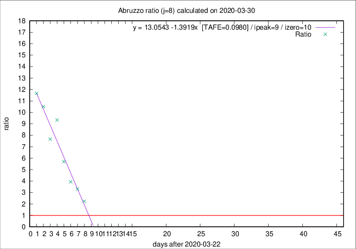

# Abruzzo

Data source: https://raw.githubusercontent.com/pcm-dpc/COVID-19/master/dati-json/dpc-covid19-ita-regioni.json

Delta days analysis (j): 8

Analyses for other values of j for 2020-03-30 are avalable [here](../2020-03-30/README.md)

Analyses for Abruzzo for previous dates are avalable [here](../README.md)

## Fitting 
|fit type|best fit equation|tafe|tfe|ipeak|izero|
|-------|-----|--------|------|---|---|
|linear|y = 13.0543 -1.3919x  [TAFE=0.0980]|0.0980|0.0086|9|10|

## Data
|Date|Daily deaths|Cumulated deaths|Deaths in the last 8 days|Deaths in the 8 days before|ratio|
|----|----------|-----------|-------|--------------------|-----|
|2020-03-30|14|102|69|31|2.2258|
|2020-03-29|12|88|66|20|3.3000|
|2020-03-28|8|76|59|15|3.9333|
|2020-03-27|5|68|57|10|5.7000|
|2020-03-26|11|63|56|6|9.3333|
|2020-03-25|6|52|46|6|7.6667|
|2020-03-24|8|46|42|4|10.5000|
|2020-03-23|5|38|35|3|11.6667|

[Download data as CSV](COVID-19_abruzzo_j8_2020-03-30.csv)

Generated April 19th, 2020 at 18:42:39 UTC+0200 with https://github.com/robianc/COVID-19
