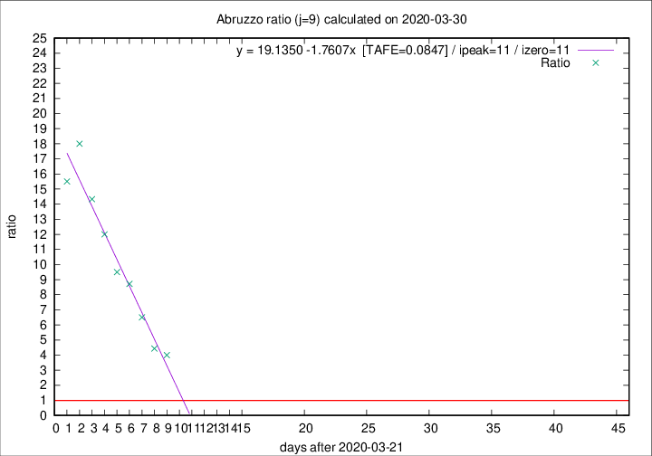

# Abruzzo

Data source: https://raw.githubusercontent.com/pcm-dpc/COVID-19/master/dati-json/dpc-covid19-ita-regioni.json

Estimates in this page were made on 10/4/2020 with data available until 30/03/2020.

## Summary 

### Peak estimate 
|j|linear [TAFE]|exponential [TAFE]|power law [TAFE]|details|
|---|----|-----------|---------|-------|
|7|31/3/2020 [TAFE=0.1857]|2/4/2020 [TAFE=0.1180]|10/4/2020 [TAFE=0.1721]|[analysis](COVID-19_abruzzo_j7_2020-03-30.md)|
|8|1/4/2020 [TAFE=0.0980]|4/4/2020 [TAFE=0.1067]|3/5/2020 [TAFE=0.2243]|[analysis](COVID-19_abruzzo_j8_2020-03-30.md)|
|9|2/4/2020 [TAFE=0.0847]|8/4/2020 [TAFE=0.1038]|-|[analysis](COVID-19_abruzzo_j9_2020-03-30.md)|
|10|4/4/2020 [TAFE=0.1257]|14/4/2020 [TAFE=0.1628]|-|[analysis](COVID-19_abruzzo_j10_2020-03-30.md)|
|11|-|-|-||
|12|-|-|-||
|13|-|-|-||
|14|-|-|-||

Best estimator is linear with j=9 (TAFE=0.0847)
Corresponding peak date estimate is 2/4/2020 (ipeak 11)

Peak date range estimate: 22/3/2020 - 2/5/2020

### End estimate 
|j|linear [TAFE/TFE]|exponential [TAFE/TFE]|power law [TAFE/TFE]|details|
|---|----|-----------|---------|-------|
|7|1/4/2020 [TAFE=0.1857]|-|-|[analysis](COVID-19_abruzzo_j7_2020-03-30.md)|
|8|2/4/2020 [TAFE=0.0980]|-|-|[analysis](COVID-19_abruzzo_j8_2020-03-30.md)|
|9|2/4/2020 [TAFE=0.0847]|-|-|[analysis](COVID-19_abruzzo_j9_2020-03-30.md)|
|10|-|-|-|[analysis](COVID-19_abruzzo_j10_2020-03-30.md)|
|11|-|-|-||
|12|-|-|-||
|13|-|-|-||
|14|-|-|-||

Best estimator is linear with j=9 (TAFE=0.0847)
Corresponding end date estimate is 2/4/2020 (izero 11)

End date range estimate: 22/3/2020 - 5/4/2020

Generated April 10th, 2020 at 17:26:10 UTC+0200 with https://github.com/robianc/COVID-19
