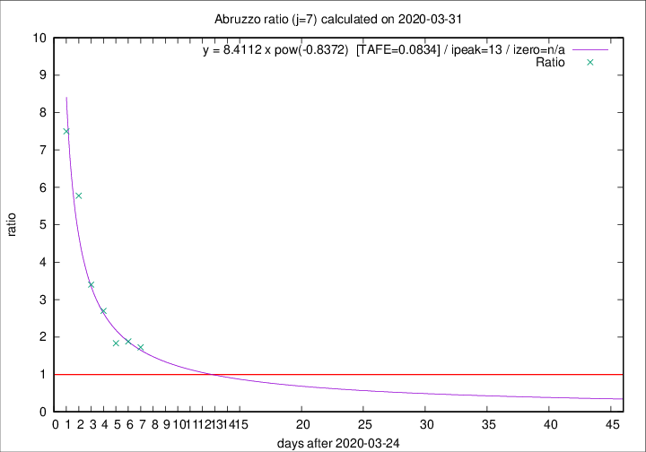

# Abruzzo

Data source: https://raw.githubusercontent.com/pcm-dpc/COVID-19/master/dati-json/dpc-covid19-ita-regioni.json

Delta days analysis (j): 7

Analyses for other values of j for 2020-03-31 are avalable [here](../2020-03-31/README.md)

Analyses for Abruzzo for previous dates are avalable [here](../README.md)

## Fitting 
|fit type|best fit equation|tafe|tfe|ipeak|izero|
|-------|-----|--------|------|---|---|
|pow|y = 8.4112 x pow(-0.8372)  [TAFE=0.0834]|0.0834|0.0063|13|n/a|

## Data
|Date|Daily deaths|Cumulated deaths|Deaths in the last 7 days|Deaths in the 7 days before|ratio|
|----|----------|-----------|-------|--------------------|-----|
|2020-03-31|13|115|69|40|1.7250|
|2020-03-30|14|102|64|34|1.8824|
|2020-03-29|12|88|55|30|1.8333|
|2020-03-28|8|76|54|20|2.7000|
|2020-03-27|5|68|51|15|3.4000|
|2020-03-26|11|63|52|9|5.7778|
|2020-03-25|6|52|45|6|7.5000|

[Download data as CSV](COVID-19_abruzzo_j7_2020-03-31.csv)

Generated April 19th, 2020 at 18:42:39 UTC+0200 with https://github.com/robianc/COVID-19
