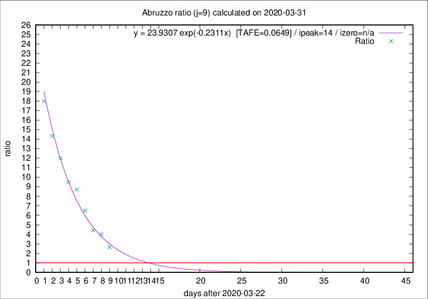

# Abruzzo

Data source: https://raw.githubusercontent.com/pcm-dpc/COVID-19/master/dati-json/dpc-covid19-ita-regioni.json

Delta days analysis (j): 9

Analyses for other values of j for 2020-03-31 are avalable [here](../2020-03-31/README.md)

Analyses for Abruzzo for previous dates are avalable [here](../README.md)

## Fitting 
|fit type|best fit equation|tafe|tfe|ipeak|izero|
|-------|-----|--------|------|---|---|
|exp|y = 23.9307 exp(-0.2311x)  [TAFE=0.0649]|0.0649|0.0033|14|n/a|

## Data
|Date|Daily deaths|Cumulated deaths|Deaths in the last 9 days|Deaths in the 9 days before|ratio|
|----|----------|-----------|-------|--------------------|-----|
|2020-03-31|13|115|82|31|2.6452|
|2020-03-30|14|102|80|20|4.0000|
|2020-03-29|12|88|71|16|4.4375|
|2020-03-28|8|76|65|10|6.5000|
|2020-03-27|5|68|61|7|8.7143|
|2020-03-26|11|63|57|6|9.5000|
|2020-03-25|6|52|48|4|12.0000|
|2020-03-24|8|46|43|3|14.3333|
|2020-03-23|5|38|36|2|18.0000|

[Download data as CSV](COVID-19_abruzzo_j9_2020-03-31.csv)

Generated April 14th, 2020 at 19:16:04 UTC+0200 with https://github.com/robianc/COVID-19
