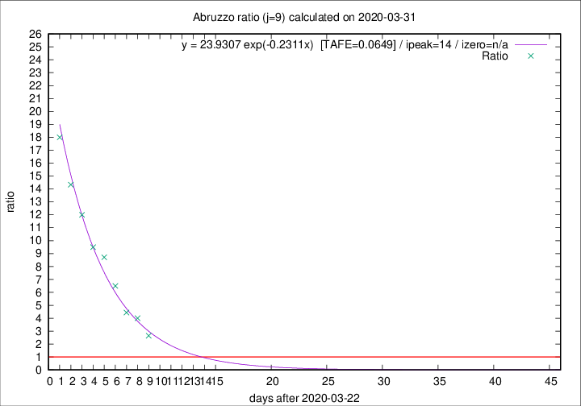

# Abruzzo

Data source: https://raw.githubusercontent.com/pcm-dpc/COVID-19/master/dati-json/dpc-covid19-ita-regioni.json

Estimates in this page were made on 19/4/2020 with data available until 31/03/2020.

## Summary 

### Peak estimate 
|j|linear [TAFE]|exponential [TAFE]|power law [TAFE]|details|
|---|----|-----------|---------|-------|
|7|1/4/2020 [TAFE=0.2834]|3/4/2020 [TAFE=0.1467]|7/4/2020 [TAFE=0.0834]|[analysis](COVID-19_abruzzo_j7_2020-03-31.md)|
|8|2/4/2020 [TAFE=0.1791]|4/4/2020 [TAFE=0.1072]|20/4/2020 [TAFE=0.1832]|[analysis](COVID-19_abruzzo_j8_2020-03-31.md)|
|9|2/4/2020 [TAFE=0.1270]|6/4/2020 [TAFE=0.0649]|11/5/2020 [TAFE=0.2074]|[analysis](COVID-19_abruzzo_j9_2020-03-31.md)|
|10|4/4/2020 [TAFE=0.1219]|11/4/2020 [TAFE=0.1675]|-|[analysis](COVID-19_abruzzo_j10_2020-03-31.md)|
|11|5/4/2020 [TAFE=0.1646]|17/4/2020 [TAFE=0.2042]|-|[analysis](COVID-19_abruzzo_j11_2020-03-31.md)|
|12|-|-|-||
|13|-|-|-||
|14|-|-|-||

Best estimator is exp with j=9 (TAFE=0.0649)
Corresponding peak date estimate is 6/4/2020 (ipeak 14)

Peak date range estimate: 23/3/2020 - 11/5/2020

### End estimate 
|j|linear [TAFE/TFE]|exponential [TAFE/TFE]|power law [TAFE/TFE]|details|
|---|----|-----------|---------|-------|
|7|2/4/2020 [TAFE=0.2834]|-|-|[analysis](COVID-19_abruzzo_j7_2020-03-31.md)|
|8|2/4/2020 [TAFE=0.1791]|-|-|[analysis](COVID-19_abruzzo_j8_2020-03-31.md)|
|9|2/4/2020 [TAFE=0.1270]|-|-|[analysis](COVID-19_abruzzo_j9_2020-03-31.md)|
|10|4/4/2020 [TAFE=0.1219]|-|-|[analysis](COVID-19_abruzzo_j10_2020-03-31.md)|
|11|-|-|-|[analysis](COVID-19_abruzzo_j11_2020-03-31.md)|
|12|-|-|-||
|13|-|-|-||
|14|-|-|-||

Best estimator is linear with j=10 (TAFE=0.1219)
Corresponding end date estimate is 4/4/2020 (izero 13)

End date range estimate: 22/3/2020 - 6/4/2020

Generated April 19th, 2020 at 18:42:39 UTC+0200 with https://github.com/robianc/COVID-19
