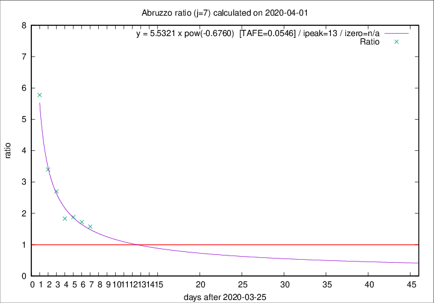

# Abruzzo

Data source: https://raw.githubusercontent.com/pcm-dpc/COVID-19/master/dati-json/dpc-covid19-ita-regioni.json

Estimates in this page were made on 19/4/2020 with data available until 01/04/2020.

## Summary 

### Peak estimate 
|j|linear [TAFE]|exponential [TAFE]|power law [TAFE]|details|
|---|----|-----------|---------|-------|
|7|2/4/2020 [TAFE=0.2479]|4/4/2020 [TAFE=0.1418]|8/4/2020 [TAFE=0.0546]|[analysis](COVID-19_abruzzo_j7_2020-04-01.md)|
|8|2/4/2020 [TAFE=0.2308]|5/4/2020 [TAFE=0.1155]|15/4/2020 [TAFE=0.1872]|[analysis](COVID-19_abruzzo_j8_2020-04-01.md)|
|9|3/4/2020 [TAFE=0.1265]|6/4/2020 [TAFE=0.0635]|29/4/2020 [TAFE=0.2004]|[analysis](COVID-19_abruzzo_j9_2020-04-01.md)|
|10|3/4/2020 [TAFE=0.1275]|8/4/2020 [TAFE=0.1067]|6/6/2020 [TAFE=0.2929]|[analysis](COVID-19_abruzzo_j10_2020-04-01.md)|
|11|4/4/2020 [TAFE=0.1260]|13/4/2020 [TAFE=0.1560]|-|[analysis](COVID-19_abruzzo_j11_2020-04-01.md)|
|12|-|-|-||
|13|-|-|-||
|14|-|-|-||

Best estimator is pow with j=7 (TAFE=0.0546)
Corresponding peak date estimate is 8/4/2020 (ipeak 13)

Peak date range estimate: 26/3/2020 - 9/6/2020

### End estimate 
|j|linear [TAFE/TFE]|exponential [TAFE/TFE]|power law [TAFE/TFE]|details|
|---|----|-----------|---------|-------|
|7|4/4/2020 [TAFE=0.2479]|-|-|[analysis](COVID-19_abruzzo_j7_2020-04-01.md)|
|8|3/4/2020 [TAFE=0.2308]|-|-|[analysis](COVID-19_abruzzo_j8_2020-04-01.md)|
|9|3/4/2020 [TAFE=0.1265]|-|-|[analysis](COVID-19_abruzzo_j9_2020-04-01.md)|
|10|-|-|-|[analysis](COVID-19_abruzzo_j10_2020-04-01.md)|
|11|4/4/2020 [TAFE=0.1260]|-|-|[analysis](COVID-19_abruzzo_j11_2020-04-01.md)|
|12|-|-|-||
|13|-|-|-||
|14|-|-|-||

Best estimator is linear with j=11 (TAFE=0.1260)
Corresponding end date estimate is 4/4/2020 (izero 13)

End date range estimate: 22/3/2020 - 4/4/2020

Generated April 19th, 2020 at 18:42:39 UTC+0200 with https://github.com/robianc/COVID-19
