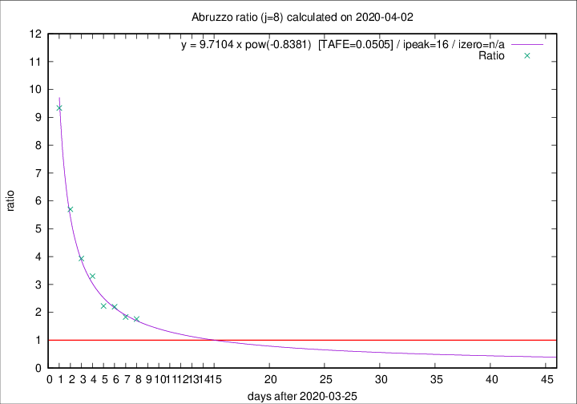
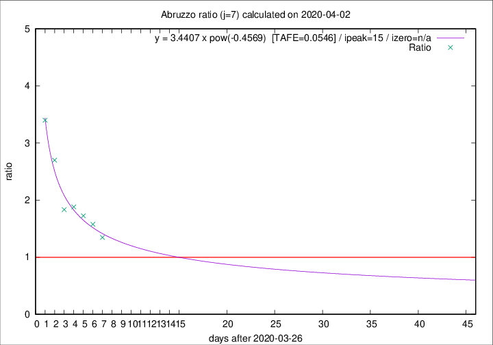

# Abruzzo

Data source: https://raw.githubusercontent.com/pcm-dpc/COVID-19/master/dati-json/dpc-covid19-ita-regioni.json

Estimates in this page were made on 19/4/2020 with data available until 02/04/2020.

## Summary 

### Peak estimate 
|j|linear [TAFE]|exponential [TAFE]|power law [TAFE]|details|
|---|----|-----------|---------|-------|
|7|4/4/2020 [TAFE=0.1092]|5/4/2020 [TAFE=0.0763]|11/4/2020 [TAFE=0.0546]|[analysis](COVID-19_abruzzo_j7_2020-04-02.md)|
|8|3/4/2020 [TAFE=0.3027]|5/4/2020 [TAFE=0.1240]|11/4/2020 [TAFE=0.0505]|[analysis](COVID-19_abruzzo_j8_2020-04-02.md)|
|9|3/4/2020 [TAFE=0.1889]|6/4/2020 [TAFE=0.0658]|21/4/2020 [TAFE=0.1856]|[analysis](COVID-19_abruzzo_j9_2020-04-02.md)|
|10|3/4/2020 [TAFE=0.1959]|7/4/2020 [TAFE=0.0586]|4/5/2020 [TAFE=0.2113]|[analysis](COVID-19_abruzzo_j10_2020-04-02.md)|
|11|4/4/2020 [TAFE=0.1205]|11/4/2020 [TAFE=0.1908]|-|[analysis](COVID-19_abruzzo_j11_2020-04-02.md)|
|12|5/4/2020 [TAFE=0.1142]|15/4/2020 [TAFE=0.1808]|-|[analysis](COVID-19_abruzzo_j12_2020-04-02.md)|
|13|-|-|-||
|14|-|-|-||

Best estimator is pow with j=8 (TAFE=0.0505)
Corresponding peak date estimate is 11/4/2020 (ipeak 16)

Peak date range estimate: 26/3/2020 - 6/5/2020

### End estimate 
|j|linear [TAFE/TFE]|exponential [TAFE/TFE]|power law [TAFE/TFE]|details|
|---|----|-----------|---------|-------|
|7|7/4/2020 [TAFE=0.1092]|-|-|[analysis](COVID-19_abruzzo_j7_2020-04-02.md)|
|8|-|-|-|[analysis](COVID-19_abruzzo_j8_2020-04-02.md)|
|9|-|-|-|[analysis](COVID-19_abruzzo_j9_2020-04-02.md)|
|10|-|-|-|[analysis](COVID-19_abruzzo_j10_2020-04-02.md)|
|11|-|-|-|[analysis](COVID-19_abruzzo_j11_2020-04-02.md)|
|12|-|-|-|[analysis](COVID-19_abruzzo_j12_2020-04-02.md)|
|13|-|-|-||
|14|-|-|-||

Best estimator is linear with j=7 (TAFE=0.1092)
Corresponding end date estimate is 7/4/2020 (izero 11)

End date range estimate: 27/3/2020 - 10/4/2020

Generated April 19th, 2020 at 18:42:39 UTC+0200 with https://github.com/robianc/COVID-19
