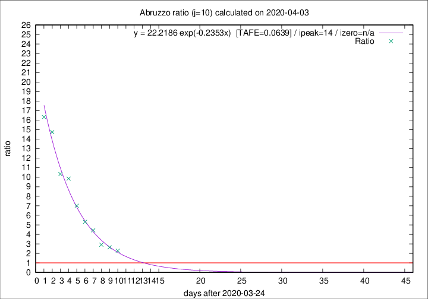

# Abruzzo

Data source: https://raw.githubusercontent.com/pcm-dpc/COVID-19/master/dati-json/dpc-covid19-ita-regioni.json

Delta days analysis (j): 10

Analyses for other values of j for 2020-04-03 are avalable [here](../2020-04-03/README.md)

Analyses for Abruzzo for previous dates are avalable [here](../README.md)

## Fitting 
|fit type|best fit equation|tafe|tfe|ipeak|izero|
|-------|-----|--------|------|---|---|
|exp|y = 22.2186 exp(-0.2353x)  [TAFE=0.0639]|0.0639|0.0029|14|n/a|

## Data
|Date|Daily deaths|Cumulated deaths|Deaths in the last 10 days|Deaths in the 10 days before|ratio|
|----|----------|-----------|-------|--------------------|-----|
|2020-04-03|13|146|100|44|2.2727|
|2020-04-02|10|133|95|36|2.6389|
|2020-04-01|8|123|90|31|2.9032|
|2020-03-31|13|115|93|21|4.4286|
|2020-03-30|14|102|85|16|5.3125|
|2020-03-29|12|88|77|11|7.0000|
|2020-03-28|8|76|69|7|9.8571|
|2020-03-27|5|68|62|6|10.3333|
|2020-03-26|11|63|59|4|14.7500|
|2020-03-25|6|52|49|3|16.3333|

[Download data as CSV](COVID-19_abruzzo_j10_2020-04-03.csv)

Generated April 14th, 2020 at 19:16:04 UTC+0200 with https://github.com/robianc/COVID-19
