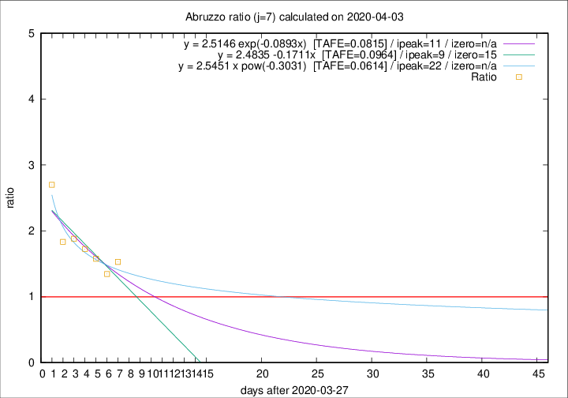

# Abruzzo

Data source: https://raw.githubusercontent.com/pcm-dpc/COVID-19/master/dati-json/dpc-covid19-ita-regioni.json

Delta days analysis (j): 7

Analyses for other values of j for 2020-04-03 are avalable [here](../README.md)

Analyses for Abruzzo for previous dates are avalable [here](../../README.md)

## Fitting 
|fit type|best fit equation|tafe|tfe|ipeak|izero|
|-------|-----|--------|------|---|---|
|linear|y = 2.4835 -0.1711x  [TAFE=0.0964]|0.0964|0.0098|9|15|
|exp|y = 2.5146 exp(-0.0893x)  [TAFE=0.0815]|0.0815|0.0048|11|n/a|
|pow|y = 2.5451 x pow(-0.3031)  [TAFE=0.0614]|0.0614|0.0025|22|n/a|

## Data
|Date|Daily deaths|Cumulated deaths|Deaths in the last 7 days|Deaths in the 7 days before|ratio|
|----|----------|-----------|-------|--------------------|-----|
|2020-04-03|13|146|78|51|1.5294|
|2020-04-02|10|133|70|52|1.3462|
|2020-04-01|8|123|71|45|1.5778|
|2020-03-31|13|115|69|40|1.7250|
|2020-03-30|14|102|64|34|1.8824|
|2020-03-29|12|88|55|30|1.8333|
|2020-03-28|8|76|54|20|2.7000|

[Download data as CSV](COVID-19_abruzzo_j7_2020-04-03.csv)

Generated April 12th, 2020 at 16:28:18 UTC+0200 with https://github.com/robianc/COVID-19
