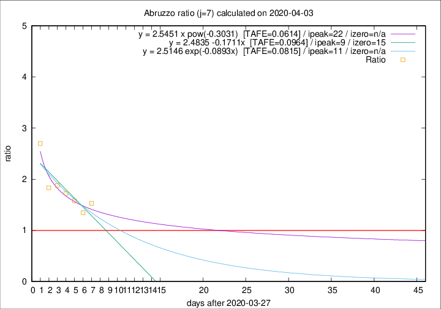

# Abruzzo

Data source: https://raw.githubusercontent.com/pcm-dpc/COVID-19/master/dati-json/dpc-covid19-ita-regioni.json

Estimates in this page were made on 12/4/2020 with data available until 03/04/2020.

## Summary 

### Peak estimate 
|j|linear [TAFE]|exponential [TAFE]|power law [TAFE]|details|
|---|----|-----------|---------|-------|
|7|6/4/2020 [TAFE=0.0964]|8/4/2020 [TAFE=0.0815]|19/4/2020 [TAFE=0.0614]|[analysis](COVID-19_abruzzo_j7_2020-04-03.md)|
|8|4/4/2020 [TAFE=0.1855]|6/4/2020 [TAFE=0.0900]|12/4/2020 [TAFE=0.0543]|[analysis](COVID-19_abruzzo_j8_2020-04-03.md)|
|9|4/4/2020 [TAFE=0.2270]|7/4/2020 [TAFE=0.0835]|18/4/2020 [TAFE=0.1509]|[analysis](COVID-19_abruzzo_j9_2020-04-03.md)|
|10|4/4/2020 [TAFE=0.2323]|8/4/2020 [TAFE=0.0639]|27/4/2020 [TAFE=0.2232]|[analysis](COVID-19_abruzzo_j10_2020-04-03.md)|
|11|4/4/2020 [TAFE=0.1825]|9/4/2020 [TAFE=0.1005]|21/5/2020 [TAFE=0.3164]|[analysis](COVID-19_abruzzo_j11_2020-04-03.md)|
|12|5/4/2020 [TAFE=0.1473]|12/4/2020 [TAFE=0.1897]|-|[analysis](COVID-19_abruzzo_j12_2020-04-03.md)|
|13|-|-|-||
|14|-|-|-||

Best estimator is pow with j=8 (TAFE=0.0543)
Corresponding peak date estimate is 12/4/2020 (ipeak 16)

Peak date range estimate: 27/3/2020 - 24/5/2020

### End estimate 
|j|linear [TAFE/TFE]|exponential [TAFE/TFE]|power law [TAFE/TFE]|details|
|---|----|-----------|---------|-------|
|7|12/4/2020 [TAFE=0.0964]|-|-|[analysis](COVID-19_abruzzo_j7_2020-04-03.md)|
|8|-|-|-|[analysis](COVID-19_abruzzo_j8_2020-04-03.md)|
|9|-|-|-|[analysis](COVID-19_abruzzo_j9_2020-04-03.md)|
|10|-|-|-|[analysis](COVID-19_abruzzo_j10_2020-04-03.md)|
|11|-|-|-|[analysis](COVID-19_abruzzo_j11_2020-04-03.md)|
|12|-|-|-|[analysis](COVID-19_abruzzo_j12_2020-04-03.md)|
|13|-|-|-||
|14|-|-|-||

Best estimator is linear with j=7 (TAFE=0.0964)
Corresponding end date estimate is 12/4/2020 (izero 15)

End date range estimate: 28/3/2020 - 12/4/2020

Generated April 12th, 2020 at 17:02:01 UTC+0200 with https://github.com/robianc/COVID-19
