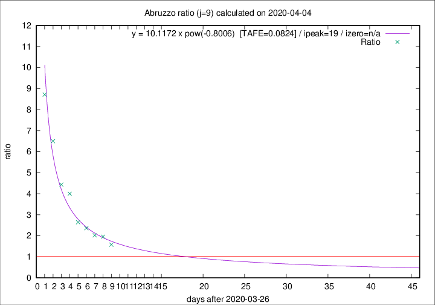

# Abruzzo

Data source: https://raw.githubusercontent.com/pcm-dpc/COVID-19/master/dati-json/dpc-covid19-ita-regioni.json

Delta days analysis (j): 9

Analyses for other values of j for 2020-04-04 are avalable [here](../README.md)

Analyses for Abruzzo for previous dates are avalable [here](../../README.md)

## Fitting 
|fit type|best fit equation|tafe|tfe|ipeak|izero|
|-------|-----|--------|------|---|---|
|pow|y = 10.1172 x pow(-0.8006)  [TAFE=0.0824]|0.0824|0.0048|19|n/a|

## Data
|Date|Daily deaths|Cumulated deaths|Deaths in the last 9 days|Deaths in the 9 days before|ratio|
|----|----------|-----------|-------|--------------------|-----|
|2020-04-04|7|153|90|57|1.5789|
|2020-04-03|13|146|94|48|1.9583|
|2020-04-02|10|133|87|43|2.0233|
|2020-04-01|8|123|85|36|2.3611|
|2020-03-31|13|115|82|31|2.6452|
|2020-03-30|14|102|80|20|4.0000|
|2020-03-29|12|88|71|16|4.4375|
|2020-03-28|8|76|65|10|6.5000|
|2020-03-27|5|68|61|7|8.7143|

[Download data as CSV](COVID-19_abruzzo_j9_2020-04-04.csv)

Generated April 10th, 2020 at 17:26:10 UTC+0200 with https://github.com/robianc/COVID-19
