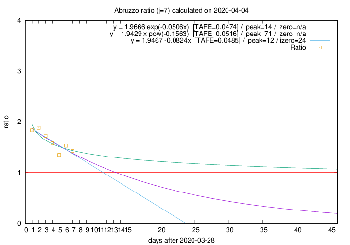

# Abruzzo

Data source: https://raw.githubusercontent.com/pcm-dpc/COVID-19/master/dati-json/dpc-covid19-ita-regioni.json

Estimates in this page were made on 14/4/2020 with data available until 04/04/2020.

## Summary 

### Peak estimate 
|j|linear [TAFE]|exponential [TAFE]|power law [TAFE]|details|
|---|----|-----------|---------|-------|
|7|10/4/2020 [TAFE=0.0485]|12/4/2020 [TAFE=0.0474]|8/6/2020 [TAFE=0.0516]|[analysis](COVID-19_abruzzo_j7_2020-04-04.md)|
|8|6/4/2020 [TAFE=0.1226]|8/4/2020 [TAFE=0.0834]|15/4/2020 [TAFE=0.0528]|[analysis](COVID-19_abruzzo_j8_2020-04-04.md)|
|9|5/4/2020 [TAFE=0.2595]|7/4/2020 [TAFE=0.1044]|15/4/2020 [TAFE=0.0824]|[analysis](COVID-19_abruzzo_j9_2020-04-04.md)|
|10|5/4/2020 [TAFE=0.2718]|8/4/2020 [TAFE=0.0721]|22/4/2020 [TAFE=0.1696]|[analysis](COVID-19_abruzzo_j10_2020-04-04.md)|
|11|5/4/2020 [TAFE=0.3048]|9/4/2020 [TAFE=0.0616]|1/5/2020 [TAFE=0.2400]|[analysis](COVID-19_abruzzo_j11_2020-04-04.md)|
|12|6/4/2020 [TAFE=0.1692]|12/4/2020 [TAFE=0.1884]|21/6/2020 [TAFE=0.4118]|[analysis](COVID-19_abruzzo_j12_2020-04-04.md)|
|13|6/4/2020 [TAFE=0.1389]|14/4/2020 [TAFE=0.2129]|-|[analysis](COVID-19_abruzzo_j13_2020-04-04.md)|
|14|-|-|-||

Best estimator is exp with j=7 (TAFE=0.0474)
Corresponding peak date estimate is 12/4/2020 (ipeak 14)

Peak date range estimate: 29/3/2020 - 26/6/2020

### End estimate 
|j|linear [TAFE/TFE]|exponential [TAFE/TFE]|power law [TAFE/TFE]|details|
|---|----|-----------|---------|-------|
|7|22/4/2020 [TAFE=0.0485]|-|-|[analysis](COVID-19_abruzzo_j7_2020-04-04.md)|
|8|-|-|-|[analysis](COVID-19_abruzzo_j8_2020-04-04.md)|
|9|-|-|-|[analysis](COVID-19_abruzzo_j9_2020-04-04.md)|
|10|-|-|-|[analysis](COVID-19_abruzzo_j10_2020-04-04.md)|
|11|-|-|-|[analysis](COVID-19_abruzzo_j11_2020-04-04.md)|
|12|-|-|-|[analysis](COVID-19_abruzzo_j12_2020-04-04.md)|
|13|-|-|-|[analysis](COVID-19_abruzzo_j13_2020-04-04.md)|
|14|-|-|-||

Best estimator is linear with j=7 (TAFE=0.0485)
Corresponding end date estimate is 22/4/2020 (izero 24)

End date range estimate: 29/3/2020 - 22/4/2020

Generated April 14th, 2020 at 19:16:04 UTC+0200 with https://github.com/robianc/COVID-19
