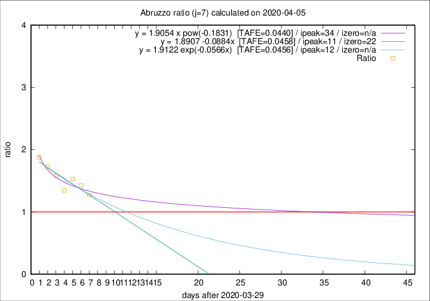

# Abruzzo

Data source: https://raw.githubusercontent.com/pcm-dpc/COVID-19/master/dati-json/dpc-covid19-ita-regioni.json

Delta days analysis (j): 7

## Fitting 
|fit type|best fit equation|tafe|tfe|ipeak|izero|
|-------|-----|--------|------|---|---|
|linear|y = 1.8907 -0.0884x  [TAFE=0.0458]|0.0458|0.0034|11|22|
|exp|y = 1.9122 exp(-0.0566x)  [TAFE=0.0456]|0.0456|0.0019|12|n/a|
|pow|y = 1.9054 x pow(-0.1831)  [TAFE=0.0440]|0.0440|0.0014|34|n/a|

## Data
|Date|Daily deaths|Cumulated deaths|Deaths in the last 7 days|Deaths in the 7 days before|ratio|
|----|----------|-----------|-------|--------------------|-----|
|2020-04-05|5|158|70|55|1.2727|
|2020-04-04|7|153|77|54|1.4259|
|2020-04-03|13|146|78|51|1.5294|
|2020-04-02|10|133|70|52|1.3462|
|2020-04-01|8|123|71|45|1.5778|
|2020-03-31|13|115|69|40|1.7250|
|2020-03-30|14|102|64|34|1.8824|

[Download data as CSV](COVID-19_abruzzo_j7_2020-04-05.csv)

Generated April 8th, 2020 at 23:43:36 UTC+0200 with https://github.com/robianc/COVID-19
