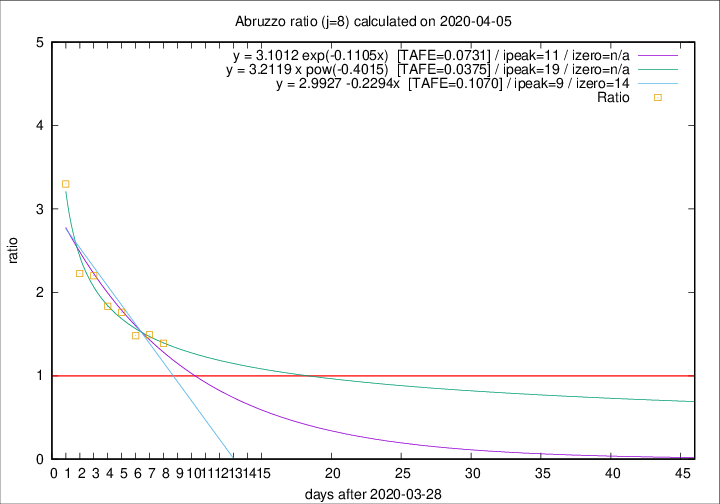

# Abruzzo

Data source: https://raw.githubusercontent.com/pcm-dpc/COVID-19/master/dati-json/dpc-covid19-ita-regioni.json

Estimates in this page were made on 9/4/2020 with data available until 05/04/2020.

## Summary 

### Peak estimate 
|j|linear [TAFE]|exponential [TAFE]|power law [TAFE]|details|
|---|----|-----------|---------|-------|
|7|10/4/2020 [TAFE=0.0458]|11/4/2020 [TAFE=0.0456]|3/5/2020 [TAFE=0.0440]|[analysis](COVID-19_abruzzo_j7_2020-04-05.md)|
|8|7/4/2020 [TAFE=0.1070]|9/4/2020 [TAFE=0.0731]|17/4/2020 [TAFE=0.0375]|[analysis](COVID-19_abruzzo_j8_2020-04-05.md)|
|9|6/4/2020 [TAFE=0.1964]|8/4/2020 [TAFE=0.0943]|15/4/2020 [TAFE=0.0565]|[analysis](COVID-19_abruzzo_j9_2020-04-05.md)|
|10|6/4/2020 [TAFE=0.2648]|8/4/2020 [TAFE=0.0718]|19/4/2020 [TAFE=0.1610]|[analysis](COVID-19_abruzzo_j10_2020-04-05.md)|
|11|6/4/2020 [TAFE=0.3251]|9/4/2020 [TAFE=0.0664]|26/4/2020 [TAFE=0.2193]|[analysis](COVID-19_abruzzo_j11_2020-04-05.md)|
|12|6/4/2020 [TAFE=0.2943]|10/4/2020 [TAFE=0.1015]|12/5/2020 [TAFE=0.3488]|[analysis](COVID-19_abruzzo_j12_2020-04-05.md)|
|13|6/4/2020 [TAFE=0.2166]|13/4/2020 [TAFE=0.1862]|18/6/2020 [TAFE=0.4199]|[analysis](COVID-19_abruzzo_j13_2020-04-05.md)|
|14|-|-|-||

Best estimator is pow with j=8 (TAFE=0.0375)
Corresponding peak date estimate is 17/4/2020 (ipeak 19)

Peak date range estimate: 29/3/2020 - 23/6/2020

### End estimate 
|j|linear [TAFE/TFE]|exponential [TAFE/TFE]|power law [TAFE/TFE]|details|
|---|----|-----------|---------|-------|
|7|21/4/2020 [TAFE=0.0458]|-|-|[analysis](COVID-19_abruzzo_j7_2020-04-05.md)|
|8|-|-|-|[analysis](COVID-19_abruzzo_j8_2020-04-05.md)|
|9|-|-|-|[analysis](COVID-19_abruzzo_j9_2020-04-05.md)|
|10|-|-|-|[analysis](COVID-19_abruzzo_j10_2020-04-05.md)|
|11|-|-|-|[analysis](COVID-19_abruzzo_j11_2020-04-05.md)|
|12|-|-|-|[analysis](COVID-19_abruzzo_j12_2020-04-05.md)|
|13|-|-|-|[analysis](COVID-19_abruzzo_j13_2020-04-05.md)|
|14|-|-|-||

Best estimator is linear with j=7 (TAFE=0.0458)
Corresponding end date estimate is 21/4/2020 (izero 22)

End date range estimate: 30/3/2020 - 21/4/2020

Generated April 9th, 2020 at 16:40:48 UTC+0200 with https://github.com/robianc/COVID-19
