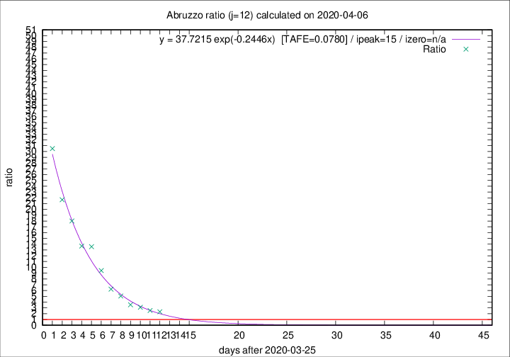

# Abruzzo

Data source: https://raw.githubusercontent.com/pcm-dpc/COVID-19/master/dati-json/dpc-covid19-ita-regioni.json

Delta days analysis (j): 12

## Fitting 
|fit type|best fit equation|tafe|tfe|ipeak|izero|
|-------|-----|--------|------|---|---|
|exp|y = 37.7215 exp(-0.2446x)  [TAFE=0.0780]|0.0780|0.0050|15|n/a|

## Data
|Date|Daily deaths|Cumulated deaths|Deaths in the last 12 days|Deaths in the 12 days before|ratio|
|----|----------|-----------|-------|--------------------|-----|
|2020-04-06|11|169|117|50|2.3400|
|2020-04-05|5|158|112|44|2.5455|
|2020-04-04|7|153|115|37|3.1081|
|2020-04-03|13|146|113|32|3.5312|
|2020-04-02|10|133|111|22|5.0455|
|2020-04-01|8|123|106|17|6.2353|
|2020-03-31|13|115|104|11|9.4545|
|2020-03-30|14|102|95|7|13.5714|
|2020-03-29|12|88|82|6|13.6667|
|2020-03-28|8|76|72|4|18.0000|
|2020-03-27|5|68|65|3|21.6667|
|2020-03-26|11|63|61|2|30.5000|

[Download data as CSV](COVID-19_abruzzo_j12_2020-04-06.csv)

Generated April 8th, 2020 at 23:43:36 UTC+0200 with https://github.com/robianc/COVID-19
