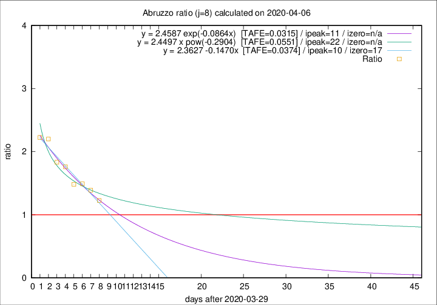

# Abruzzo

Data source: https://raw.githubusercontent.com/pcm-dpc/COVID-19/master/dati-json/dpc-covid19-ita-regioni.json

Estimates in this page were made on 14/4/2020 with data available until 06/04/2020.

## Summary 

### Peak estimate 
|j|linear [TAFE]|exponential [TAFE]|power law [TAFE]|details|
|---|----|-----------|---------|-------|
|7|9/4/2020 [TAFE=0.0599]|10/4/2020 [TAFE=0.0617]|19/4/2020 [TAFE=0.0706]|[analysis](COVID-19_abruzzo_j7_2020-04-06.md)|
|8|9/4/2020 [TAFE=0.0374]|10/4/2020 [TAFE=0.0315]|21/4/2020 [TAFE=0.0551]|[analysis](COVID-19_abruzzo_j8_2020-04-06.md)|
|9|7/4/2020 [TAFE=0.1536]|9/4/2020 [TAFE=0.0869]|16/4/2020 [TAFE=0.0584]|[analysis](COVID-19_abruzzo_j9_2020-04-06.md)|
|10|7/4/2020 [TAFE=0.2812]|9/4/2020 [TAFE=0.0940]|16/4/2020 [TAFE=0.0815]|[analysis](COVID-19_abruzzo_j10_2020-04-06.md)|
|11|6/4/2020 [TAFE=0.3395]|9/4/2020 [TAFE=0.0816]|22/4/2020 [TAFE=0.1877]|[analysis](COVID-19_abruzzo_j11_2020-04-06.md)|
|12|6/4/2020 [TAFE=0.4255]|10/4/2020 [TAFE=0.0780]|29/4/2020 [TAFE=0.2493]|[analysis](COVID-19_abruzzo_j12_2020-04-06.md)|
|13|7/4/2020 [TAFE=0.2757]|12/4/2020 [TAFE=0.1782]|31/5/2020 [TAFE=0.4437]|[analysis](COVID-19_abruzzo_j13_2020-04-06.md)|
|14|7/4/2020 [TAFE=0.2109]|14/4/2020 [TAFE=0.2075]|-|[analysis](COVID-19_abruzzo_j14_2020-04-06.md)|

Best estimator is exp with j=8 (TAFE=0.0315)
Corresponding peak date estimate is 10/4/2020 (ipeak 11)

Peak date range estimate: 30/3/2020 - 5/6/2020

### End estimate 
|j|linear [TAFE/TFE]|exponential [TAFE/TFE]|power law [TAFE/TFE]|details|
|---|----|-----------|---------|-------|
|7|20/4/2020 [TAFE=0.0599]|-|-|[analysis](COVID-19_abruzzo_j7_2020-04-06.md)|
|8|16/4/2020 [TAFE=0.0374]|-|-|[analysis](COVID-19_abruzzo_j8_2020-04-06.md)|
|9|-|-|-|[analysis](COVID-19_abruzzo_j9_2020-04-06.md)|
|10|-|-|-|[analysis](COVID-19_abruzzo_j10_2020-04-06.md)|
|11|-|-|-|[analysis](COVID-19_abruzzo_j11_2020-04-06.md)|
|12|-|-|-|[analysis](COVID-19_abruzzo_j12_2020-04-06.md)|
|13|-|-|-|[analysis](COVID-19_abruzzo_j13_2020-04-06.md)|
|14|-|-|-|[analysis](COVID-19_abruzzo_j14_2020-04-06.md)|

Best estimator is linear with j=8 (TAFE=0.0374)
Corresponding end date estimate is 16/4/2020 (izero 17)

End date range estimate: 30/3/2020 - 19/4/2020

Generated April 14th, 2020 at 19:16:04 UTC+0200 with https://github.com/robianc/COVID-19
