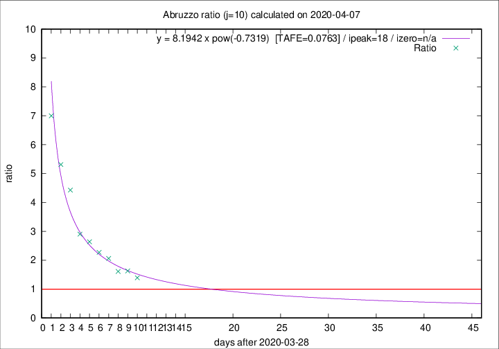

# Abruzzo

Data source: https://raw.githubusercontent.com/pcm-dpc/COVID-19/master/dati-json/dpc-covid19-ita-regioni.json

Delta days analysis (j): 10

Analyses for other values of j for 2020-04-07 are avalable [here](../README.md)

Analyses for Abruzzo for previous dates are avalable [here](../../README.md)

## Fitting 
|fit type|best fit equation|tafe|tfe|ipeak|izero|
|-------|-----|--------|------|---|---|
|pow|y = 8.1942 x pow(-0.7319)  [TAFE=0.0763]|0.0763|0.0045|18|n/a|

## Data
|Date|Daily deaths|Cumulated deaths|Deaths in the last 10 days|Deaths in the 10 days before|ratio|
|----|----------|-----------|-------|--------------------|-----|
|2020-04-07|3|172|96|69|1.3913|
|2020-04-06|11|169|101|62|1.6290|
|2020-04-05|5|158|95|59|1.6102|
|2020-04-04|7|153|101|49|2.0612|
|2020-04-03|13|146|100|44|2.2727|
|2020-04-02|10|133|95|36|2.6389|
|2020-04-01|8|123|90|31|2.9032|
|2020-03-31|13|115|93|21|4.4286|
|2020-03-30|14|102|85|16|5.3125|
|2020-03-29|12|88|77|11|7.0000|

[Download data as CSV](COVID-19_abruzzo_j10_2020-04-07.csv)

Generated April 12th, 2020 at 16:28:18 UTC+0200 with https://github.com/robianc/COVID-19
