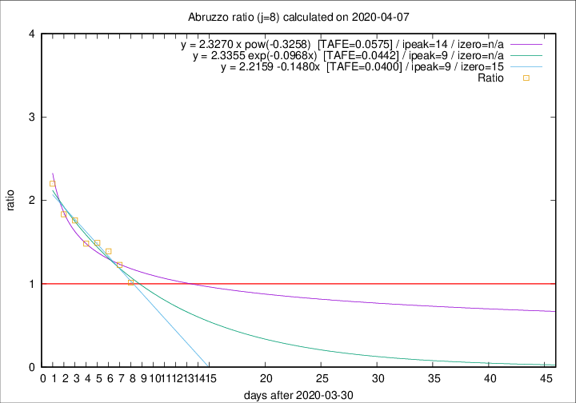

# Abruzzo

Data source: https://raw.githubusercontent.com/pcm-dpc/COVID-19/master/dati-json/dpc-covid19-ita-regioni.json

Delta days analysis (j): 8

Analyses for other values of j for 2020-04-07 are avalable [here](../2020-04-07/README.md)

Analyses for Abruzzo for previous dates are avalable [here](../README.md)

## Fitting 
|fit type|best fit equation|tafe|tfe|ipeak|izero|
|-------|-----|--------|------|---|---|
|linear|y = 2.2159 -0.1480x  [TAFE=0.0400]|0.0400|0.0016|9|15|
|exp|y = 2.3355 exp(-0.0968x)  [TAFE=0.0442]|0.0442|0.0010|9|n/a|
|pow|y = 2.3270 x pow(-0.3258)  [TAFE=0.0575]|0.0575|0.0028|14|n/a|

## Data
|Date|Daily deaths|Cumulated deaths|Deaths in the last 8 days|Deaths in the 8 days before|ratio|
|----|----------|-----------|-------|--------------------|-----|
|2020-04-07|3|172|70|69|1.0145|
|2020-04-06|11|169|81|66|1.2273|
|2020-04-05|5|158|82|59|1.3898|
|2020-04-04|7|153|85|57|1.4912|
|2020-04-03|13|146|83|56|1.4821|
|2020-04-02|10|133|81|46|1.7609|
|2020-04-01|8|123|77|42|1.8333|
|2020-03-31|13|115|77|35|2.2000|

[Download data as CSV](COVID-19_abruzzo_j8_2020-04-07.csv)

Generated April 12th, 2020 at 17:02:01 UTC+0200 with https://github.com/robianc/COVID-19
