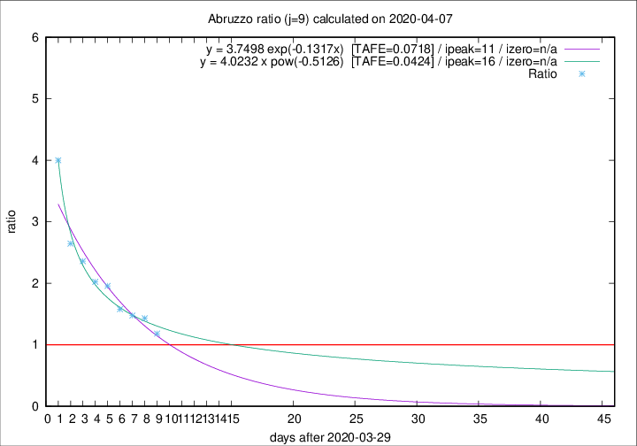

# Abruzzo

Data source: https://raw.githubusercontent.com/pcm-dpc/COVID-19/master/dati-json/dpc-covid19-ita-regioni.json

Delta days analysis (j): 9

## Fitting 
|fit type|best fit equation|tafe|tfe|ipeak|izero|
|-------|-----|--------|------|---|---|
|exp|y = 3.7498 exp(-0.1317x)  [TAFE=0.0718]|0.0718|0.0042|11|n/a|
|pow|y = 4.0232 x pow(-0.5126)  [TAFE=0.0424]|0.0424|0.0015|16|n/a|

## Data
|Date|Daily deaths|Cumulated deaths|Deaths in the last 9 days|Deaths in the 9 days before|ratio|
|----|----------|-----------|-------|--------------------|-----|
|2020-04-07|3|172|84|71|1.1831|
|2020-04-06|11|169|93|65|1.4308|
|2020-04-05|5|158|90|61|1.4754|
|2020-04-04|7|153|90|57|1.5789|
|2020-04-03|13|146|94|48|1.9583|
|2020-04-02|10|133|87|43|2.0233|
|2020-04-01|8|123|85|36|2.3611|
|2020-03-31|13|115|82|31|2.6452|
|2020-03-30|14|102|80|20|4.0000|

[Download data as CSV](COVID-19_abruzzo_j9_2020-04-07.csv)

Generated April 8th, 2020 at 23:43:36 UTC+0200 with https://github.com/robianc/COVID-19
