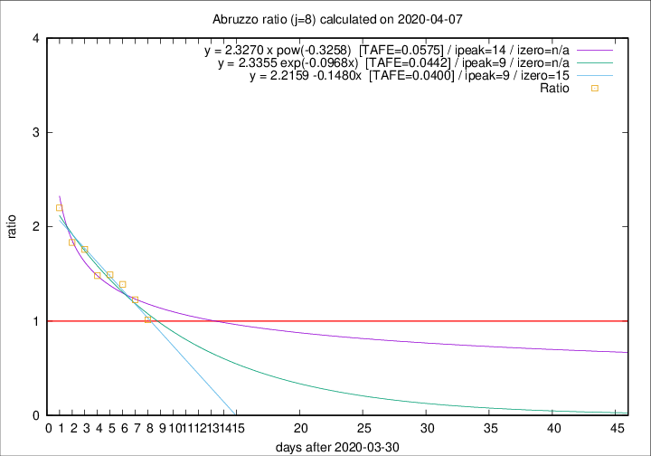

# Abruzzo

Data source: https://raw.githubusercontent.com/pcm-dpc/COVID-19/master/dati-json/dpc-covid19-ita-regioni.json

Estimates in this page were made on 12/4/2020 with data available until 07/04/2020.

## Summary 

### Peak estimate 
|j|linear [TAFE]|exponential [TAFE]|power law [TAFE]|details|
|---|----|-----------|---------|-------|
|7|8/4/2020 [TAFE=0.0832]|8/4/2020 [TAFE=0.0930]|10/4/2020 [TAFE=0.1254]|[analysis](COVID-19_abruzzo_j7_2020-04-07.md)|
|8|9/4/2020 [TAFE=0.0400]|9/4/2020 [TAFE=0.0442]|14/4/2020 [TAFE=0.0575]|[analysis](COVID-19_abruzzo_j8_2020-04-07.md)|
|9|8/4/2020 [TAFE=0.1289]|10/4/2020 [TAFE=0.0718]|15/4/2020 [TAFE=0.0424]|[analysis](COVID-19_abruzzo_j9_2020-04-07.md)|
|10|8/4/2020 [TAFE=0.2210]|10/4/2020 [TAFE=0.0993]|16/4/2020 [TAFE=0.0763]|[analysis](COVID-19_abruzzo_j10_2020-04-07.md)|
|11|7/4/2020 [TAFE=0.3415]|10/4/2020 [TAFE=0.0915]|19/4/2020 [TAFE=0.1676]|[analysis](COVID-19_abruzzo_j11_2020-04-07.md)|
|12|7/4/2020 [TAFE=0.4302]|11/4/2020 [TAFE=0.0853]|25/4/2020 [TAFE=0.2390]|[analysis](COVID-19_abruzzo_j12_2020-04-07.md)|
|13|7/4/2020 [TAFE=0.4216]|12/4/2020 [TAFE=0.1037]|7/5/2020 [TAFE=0.3565]|[analysis](COVID-19_abruzzo_j13_2020-04-07.md)|
|14|7/4/2020 [TAFE=0.3392]|14/4/2020 [TAFE=0.1829]|31/5/2020 [TAFE=0.4509]|[analysis](COVID-19_abruzzo_j14_2020-04-07.md)|

Best estimator is linear with j=8 (TAFE=0.0400)
Corresponding peak date estimate is 9/4/2020 (ipeak 9)

Peak date range estimate: 7/4/2020 - 6/6/2020

### End estimate 
|j|linear [TAFE/TFE]|exponential [TAFE/TFE]|power law [TAFE/TFE]|details|
|---|----|-----------|---------|-------|
|7|17/4/2020 [TAFE=0.0832]|-|-|[analysis](COVID-19_abruzzo_j7_2020-04-07.md)|
|8|15/4/2020 [TAFE=0.0400]|-|-|[analysis](COVID-19_abruzzo_j8_2020-04-07.md)|
|9|-|-|-|[analysis](COVID-19_abruzzo_j9_2020-04-07.md)|
|10|-|-|-|[analysis](COVID-19_abruzzo_j10_2020-04-07.md)|
|11|-|-|-|[analysis](COVID-19_abruzzo_j11_2020-04-07.md)|
|12|-|-|-|[analysis](COVID-19_abruzzo_j12_2020-04-07.md)|
|13|-|-|-|[analysis](COVID-19_abruzzo_j13_2020-04-07.md)|
|14|-|-|-|[analysis](COVID-19_abruzzo_j14_2020-04-07.md)|

Best estimator is linear with j=8 (TAFE=0.0400)
Corresponding end date estimate is 15/4/2020 (izero 15)

End date range estimate: 31/3/2020 - 16/4/2020

Generated April 12th, 2020 at 16:28:18 UTC+0200 with https://github.com/robianc/COVID-19
