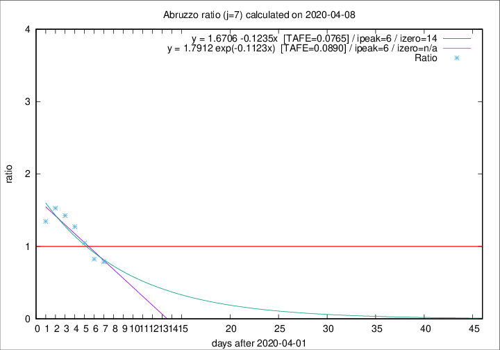

# Abruzzo

Data source: https://raw.githubusercontent.com/pcm-dpc/COVID-19/master/dati-json/dpc-covid19-ita-regioni.json

Delta days analysis (j): 7

Analyses for other values of j for 2020-04-08 are avalable [here](../README.md)

Analyses for Abruzzo for previous dates are avalable [here](../../README.md)

## Fitting 
|fit type|best fit equation|tafe|tfe|ipeak|izero|
|-------|-----|--------|------|---|---|
|linear|y = 1.6706 -0.1235x  [TAFE=0.0765]|0.0765|0.0099|6|14|
|exp|y = 1.7912 exp(-0.1123x)  [TAFE=0.0890]|0.0890|0.0051|6|n/a|

## Data
|Date|Daily deaths|Cumulated deaths|Deaths in the last 7 days|Deaths in the 7 days before|ratio|
|----|----------|-----------|-------|--------------------|-----|
|2020-04-08|7|179|56|71|0.7887|
|2020-04-07|3|172|57|69|0.8261|
|2020-04-06|11|169|67|64|1.0469|
|2020-04-05|5|158|70|55|1.2727|
|2020-04-04|7|153|77|54|1.4259|
|2020-04-03|13|146|78|51|1.5294|
|2020-04-02|10|133|70|52|1.3462|

[Download data as CSV](COVID-19_abruzzo_j7_2020-04-08.csv)

Generated April 10th, 2020 at 17:26:10 UTC+0200 with https://github.com/robianc/COVID-19
