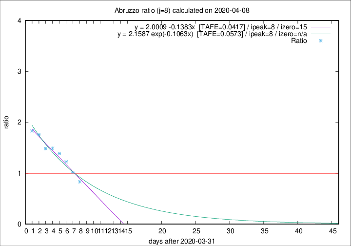

# Abruzzo

Data source: https://raw.githubusercontent.com/pcm-dpc/COVID-19/master/dati-json/dpc-covid19-ita-regioni.json

Delta days analysis (j): 8

## Fitting 
|fit type|best fit equation|tafe|tfe|ipeak|izero|
|-------|-----|--------|------|---|---|
|linear|y = 2.0009 -0.1383x  [TAFE=0.0417]|0.0417|0.0033|8|15|
|exp|y = 2.1587 exp(-0.1063x)  [TAFE=0.0573]|0.0573|0.0022|8|n/a|

## Data
|Date|Daily deaths|Cumulated deaths|Deaths in the last 8 days|Deaths in the 8 days before|ratio|
|----|----------|-----------|-------|--------------------|-----|
|2020-04-08|7|179|64|77|0.8312|
|2020-04-07|3|172|70|69|1.0145|
|2020-04-06|11|169|81|66|1.2273|
|2020-04-05|5|158|82|59|1.3898|
|2020-04-04|7|153|85|57|1.4912|
|2020-04-03|13|146|83|56|1.4821|
|2020-04-02|10|133|81|46|1.7609|
|2020-04-01|8|123|77|42|1.8333|

[Download data as CSV](COVID-19_abruzzo_j8_2020-04-08.csv)

Generated April 9th, 2020 at 16:40:48 UTC+0200 with https://github.com/robianc/COVID-19
