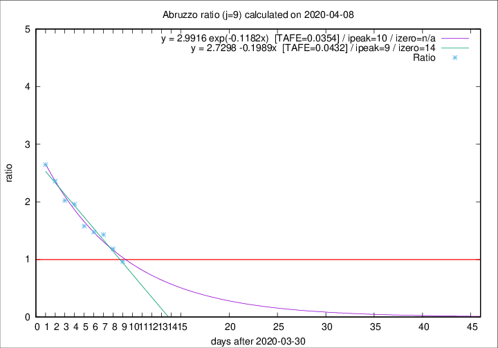

# Abruzzo

Data source: https://raw.githubusercontent.com/pcm-dpc/COVID-19/master/dati-json/dpc-covid19-ita-regioni.json

Estimates in this page were made on 8/4/2020 with data available until 08/04/2020.

## Summary 

### Peak estimate 
|j|linear [TAFE]|exponential [TAFE]|power law [TAFE]|details|
|---|----|-----------|---------|-------|
|7|8/4/2020 [TAFE=0.0765]|8/4/2020 [TAFE=0.0890]|8/4/2020 [TAFE=0.1461]|[analysis](COVID-19_abruzzo_j7_2020-04-08.md)|
|8|9/4/2020 [TAFE=0.0417]|9/4/2020 [TAFE=0.0573]|10/4/2020 [TAFE=0.1074]|[analysis](COVID-19_abruzzo_j8_2020-04-08.md)|
|9|9/4/2020 [TAFE=0.0432]|10/4/2020 [TAFE=0.0354]|14/4/2020 [TAFE=0.0925]|[analysis](COVID-19_abruzzo_j9_2020-04-08.md)|
|10|9/4/2020 [TAFE=0.1942]|10/4/2020 [TAFE=0.0881]|15/4/2020 [TAFE=0.0797]|[analysis](COVID-19_abruzzo_j10_2020-04-08.md)|
|11|8/4/2020 [TAFE=0.3665]|10/4/2020 [TAFE=0.1150]|17/4/2020 [TAFE=0.0866]|[analysis](COVID-19_abruzzo_j11_2020-04-08.md)|
|12|8/4/2020 [TAFE=0.4622]|11/4/2020 [TAFE=0.1027]|21/4/2020 [TAFE=0.1877]|[analysis](COVID-19_abruzzo_j12_2020-04-08.md)|
|13|8/4/2020 [TAFE=0.5681]|12/4/2020 [TAFE=0.0843]|27/4/2020 [TAFE=0.2891]|[analysis](COVID-19_abruzzo_j13_2020-04-08.md)|
|14|8/4/2020 [TAFE=0.4010]|13/4/2020 [TAFE=0.1713]|19/5/2020 [TAFE=0.4692]|[analysis](COVID-19_abruzzo_j14_2020-04-08.md)|

Best estimator is exp with j=9 (TAFE=0.0354)
Corresponding peak date estimate is 10/4/2020 (ipeak 10)

Peak date range estimate: 6/4/2020 - 24/5/2020

### End estimate 
|j|linear [TAFE/TFE]|exponential [TAFE/TFE]|power law [TAFE/TFE]|details|
|---|----|-----------|---------|-------|
|7|16/4/2020 [TAFE=0.0765]|-|-|[analysis](COVID-19_abruzzo_j7_2020-04-08.md)|
|8|16/4/2020 [TAFE=0.0417]|-|-|[analysis](COVID-19_abruzzo_j8_2020-04-08.md)|
|9|-|-|-|[analysis](COVID-19_abruzzo_j9_2020-04-08.md)|
|10|-|-|-|[analysis](COVID-19_abruzzo_j10_2020-04-08.md)|
|11|-|-|-|[analysis](COVID-19_abruzzo_j11_2020-04-08.md)|
|12|-|-|-|[analysis](COVID-19_abruzzo_j12_2020-04-08.md)|
|13|-|-|-|[analysis](COVID-19_abruzzo_j13_2020-04-08.md)|
|14|-|-|-|[analysis](COVID-19_abruzzo_j14_2020-04-08.md)|

Best estimator is linear with j=8 (TAFE=0.0417)
Corresponding end date estimate is 16/4/2020 (izero 15)

End date range estimate: 1/4/2020 - 16/4/2020

Generated April 8th, 2020 at 23:43:36 UTC+0200 with https://github.com/robianc/COVID-19
