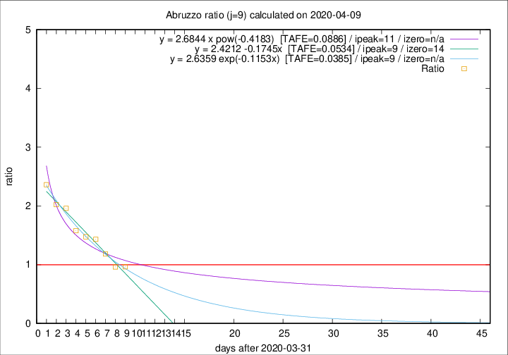

# Abruzzo

Data source: https://raw.githubusercontent.com/pcm-dpc/COVID-19/master/dati-json/dpc-covid19-ita-regioni.json

Delta days analysis (j): 9

Analyses for other values of j for 2020-04-09 are avalable [here](../README.md)

Analyses for Abruzzo for previous dates are avalable [here](../../README.md)

## Fitting 
|fit type|best fit equation|tafe|tfe|ipeak|izero|
|-------|-----|--------|------|---|---|
|linear|y = 2.4212 -0.1745x  [TAFE=0.0534]|0.0534|0.0009|9|14|
|exp|y = 2.6359 exp(-0.1153x)  [TAFE=0.0385]|0.0385|0.0014|9|n/a|
|pow|y = 2.6844 x pow(-0.4183)  [TAFE=0.0886]|0.0886|0.0053|11|n/a|

## Data
|Date|Daily deaths|Cumulated deaths|Deaths in the last 9 days|Deaths in the 9 days before|ratio|
|----|----------|-----------|-------|--------------------|-----|
|2020-04-09|15|194|79|82|0.9634|
|2020-04-08|7|179|77|80|0.9625|
|2020-04-07|3|172|84|71|1.1831|
|2020-04-06|11|169|93|65|1.4308|
|2020-04-05|5|158|90|61|1.4754|
|2020-04-04|7|153|90|57|1.5789|
|2020-04-03|13|146|94|48|1.9583|
|2020-04-02|10|133|87|43|2.0233|
|2020-04-01|8|123|85|36|2.3611|

[Download data as CSV](COVID-19_abruzzo_j9_2020-04-09.csv)

Generated April 12th, 2020 at 16:28:18 UTC+0200 with https://github.com/robianc/COVID-19
