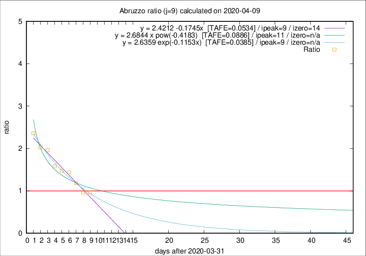

# Abruzzo

Data source: https://raw.githubusercontent.com/pcm-dpc/COVID-19/master/dati-json/dpc-covid19-ita-regioni.json

Estimates in this page were made on 12/4/2020 with data available until 09/04/2020.

## Summary 

### Peak estimate 
|j|linear [TAFE]|exponential [TAFE]|power law [TAFE]|details|
|---|----|-----------|---------|-------|
|7|8/4/2020 [TAFE=0.0819]|8/4/2020 [TAFE=0.0699]|8/4/2020 [TAFE=0.0893]|[analysis](COVID-19_abruzzo_j7_2020-04-09.md)|
|8|9/4/2020 [TAFE=0.0618]|9/4/2020 [TAFE=0.0603]|9/4/2020 [TAFE=0.0897]|[analysis](COVID-19_abruzzo_j8_2020-04-09.md)|
|9|10/4/2020 [TAFE=0.0534]|10/4/2020 [TAFE=0.0385]|12/4/2020 [TAFE=0.0886]|[analysis](COVID-19_abruzzo_j9_2020-04-09.md)|
|10|10/4/2020 [TAFE=0.1351]|11/4/2020 [TAFE=0.0618]|14/4/2020 [TAFE=0.0722]|[analysis](COVID-19_abruzzo_j10_2020-04-09.md)|
|11|9/4/2020 [TAFE=0.2775]|11/4/2020 [TAFE=0.1025]|17/4/2020 [TAFE=0.0727]|[analysis](COVID-19_abruzzo_j11_2020-04-09.md)|
|12|9/4/2020 [TAFE=0.4466]|12/4/2020 [TAFE=0.1314]|20/4/2020 [TAFE=0.1511]|[analysis](COVID-19_abruzzo_j12_2020-04-09.md)|
|13|9/4/2020 [TAFE=0.5661]|12/4/2020 [TAFE=0.1078]|25/4/2020 [TAFE=0.2488]|[analysis](COVID-19_abruzzo_j13_2020-04-09.md)|
|14|9/4/2020 [TAFE=0.5891]|13/4/2020 [TAFE=0.1244]|4/5/2020 [TAFE=0.3878]|[analysis](COVID-19_abruzzo_j14_2020-04-09.md)|

Best estimator is exp with j=9 (TAFE=0.0385)
Corresponding peak date estimate is 10/4/2020 (ipeak 9)

Peak date range estimate: 6/4/2020 - 9/5/2020

### End estimate 
|j|linear [TAFE/TFE]|exponential [TAFE/TFE]|power law [TAFE/TFE]|details|
|---|----|-----------|---------|-------|
|7|16/4/2020 [TAFE=0.0819]|-|-|[analysis](COVID-19_abruzzo_j7_2020-04-09.md)|
|8|17/4/2020 [TAFE=0.0618]|-|-|[analysis](COVID-19_abruzzo_j8_2020-04-09.md)|
|9|15/4/2020 [TAFE=0.0534]|-|-|[analysis](COVID-19_abruzzo_j9_2020-04-09.md)|
|10|-|-|-|[analysis](COVID-19_abruzzo_j10_2020-04-09.md)|
|11|-|-|-|[analysis](COVID-19_abruzzo_j11_2020-04-09.md)|
|12|-|-|-|[analysis](COVID-19_abruzzo_j12_2020-04-09.md)|
|13|-|-|-|[analysis](COVID-19_abruzzo_j13_2020-04-09.md)|
|14|-|-|-|[analysis](COVID-19_abruzzo_j14_2020-04-09.md)|

Best estimator is linear with j=9 (TAFE=0.0534)
Corresponding end date estimate is 15/4/2020 (izero 14)

End date range estimate: 1/4/2020 - 16/4/2020

Generated April 12th, 2020 at 16:28:18 UTC+0200 with https://github.com/robianc/COVID-19
