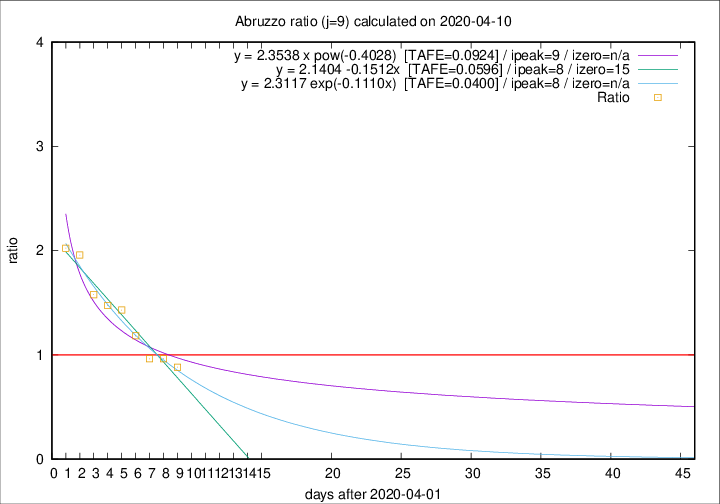

# Abruzzo

Data source: https://raw.githubusercontent.com/pcm-dpc/COVID-19/master/dati-json/dpc-covid19-ita-regioni.json

Delta days analysis (j): 9

Analyses for other values of j for 2020-04-10 are avalable [here](../2020-04-10/README.md)

Analyses for Abruzzo for previous dates are avalable [here](../README.md)

## Fitting 
|fit type|best fit equation|tafe|tfe|ipeak|izero|
|-------|-----|--------|------|---|---|
|linear|y = 2.1404 -0.1512x  [TAFE=0.0596]|0.0596|0.0016|8|15|
|exp|y = 2.3117 exp(-0.1110x)  [TAFE=0.0400]|0.0400|0.0011|8|n/a|
|pow|y = 2.3538 x pow(-0.4028)  [TAFE=0.0924]|0.0924|0.0050|9|n/a|

## Data
|Date|Daily deaths|Cumulated deaths|Deaths in the last 9 days|Deaths in the 9 days before|ratio|
|----|----------|-----------|-------|--------------------|-----|
|2020-04-10|4|198|75|85|0.8824|
|2020-04-09|15|194|79|82|0.9634|
|2020-04-08|7|179|77|80|0.9625|
|2020-04-07|3|172|84|71|1.1831|
|2020-04-06|11|169|93|65|1.4308|
|2020-04-05|5|158|90|61|1.4754|
|2020-04-04|7|153|90|57|1.5789|
|2020-04-03|13|146|94|48|1.9583|
|2020-04-02|10|133|87|43|2.0233|

[Download data as CSV](COVID-19_abruzzo_j9_2020-04-10.csv)

Generated April 14th, 2020 at 19:16:04 UTC+0200 with https://github.com/robianc/COVID-19
