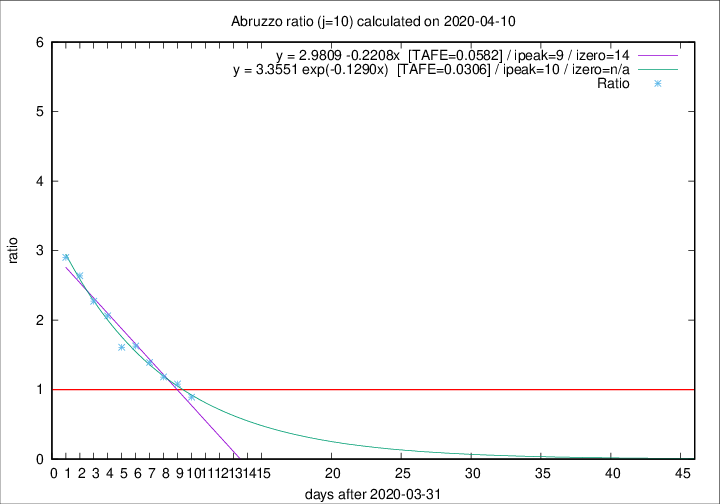

# Abruzzo

Data source: https://raw.githubusercontent.com/pcm-dpc/COVID-19/master/dati-json/dpc-covid19-ita-regioni.json

Estimates in this page were made on 12/4/2020 with data available until 10/04/2020.

## Summary 

### Peak estimate 
|j|linear [TAFE]|exponential [TAFE]|power law [TAFE]|details|
|---|----|-----------|---------|-------|
|7|8/4/2020 [TAFE=0.0920]|8/4/2020 [TAFE=0.0699]|7/4/2020 [TAFE=0.0750]|[analysis](COVID-19_abruzzo_j7_2020-04-10.md)|
|8|9/4/2020 [TAFE=0.0668]|9/4/2020 [TAFE=0.0630]|9/4/2020 [TAFE=0.0922]|[analysis](COVID-19_abruzzo_j8_2020-04-10.md)|
|9|10/4/2020 [TAFE=0.0596]|10/4/2020 [TAFE=0.0400]|11/4/2020 [TAFE=0.0924]|[analysis](COVID-19_abruzzo_j9_2020-04-10.md)|
|10|10/4/2020 [TAFE=0.0582]|11/4/2020 [TAFE=0.0306]|14/4/2020 [TAFE=0.1087]|[analysis](COVID-19_abruzzo_j10_2020-04-10.md)|
|11|10/4/2020 [TAFE=0.2140]|12/4/2020 [TAFE=0.0790]|16/4/2020 [TAFE=0.0825]|[analysis](COVID-19_abruzzo_j11_2020-04-10.md)|
|12|10/4/2020 [TAFE=0.4699]|12/4/2020 [TAFE=0.1452]|18/4/2020 [TAFE=0.0788]|[analysis](COVID-19_abruzzo_j12_2020-04-10.md)|
|13|10/4/2020 [TAFE=0.5919]|13/4/2020 [TAFE=0.1417]|22/4/2020 [TAFE=0.1828]|[analysis](COVID-19_abruzzo_j13_2020-04-10.md)|
|14|9/4/2020 [TAFE=0.7350]|13/4/2020 [TAFE=0.1112]|27/4/2020 [TAFE=0.2915]|[analysis](COVID-19_abruzzo_j14_2020-04-10.md)|

Best estimator is exp with j=10 (TAFE=0.0306)
Corresponding peak date estimate is 11/4/2020 (ipeak 10)

Peak date range estimate: 4/4/2020 - 1/5/2020

### End estimate 
|j|linear [TAFE/TFE]|exponential [TAFE/TFE]|power law [TAFE/TFE]|details|
|---|----|-----------|---------|-------|
|7|17/4/2020 [TAFE=0.0920]|-|-|[analysis](COVID-19_abruzzo_j7_2020-04-10.md)|
|8|18/4/2020 [TAFE=0.0668]|-|-|[analysis](COVID-19_abruzzo_j8_2020-04-10.md)|
|9|17/4/2020 [TAFE=0.0596]|-|-|[analysis](COVID-19_abruzzo_j9_2020-04-10.md)|
|10|15/4/2020 [TAFE=0.0582]|-|-|[analysis](COVID-19_abruzzo_j10_2020-04-10.md)|
|11|-|-|-|[analysis](COVID-19_abruzzo_j11_2020-04-10.md)|
|12|-|-|-|[analysis](COVID-19_abruzzo_j12_2020-04-10.md)|
|13|-|-|-|[analysis](COVID-19_abruzzo_j13_2020-04-10.md)|
|14|-|-|-|[analysis](COVID-19_abruzzo_j14_2020-04-10.md)|

Best estimator is linear with j=10 (TAFE=0.0582)
Corresponding end date estimate is 15/4/2020 (izero 14)

End date range estimate: 1/4/2020 - 16/4/2020

Generated April 12th, 2020 at 16:28:18 UTC+0200 with https://github.com/robianc/COVID-19
