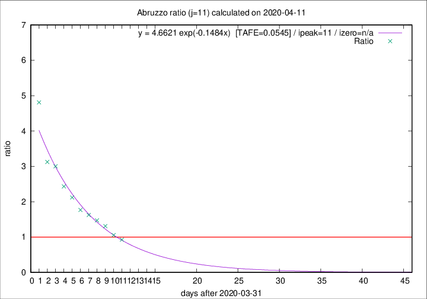

# Abruzzo

Data source: https://raw.githubusercontent.com/pcm-dpc/COVID-19/master/dati-json/dpc-covid19-ita-regioni.json

Delta days analysis (j): 11

Analyses for other values of j for 2020-04-11 are avalable [here](../2020-04-11/README.md)

Analyses for Abruzzo for previous dates are avalable [here](../README.md)

## Fitting 
|fit type|best fit equation|tafe|tfe|ipeak|izero|
|-------|-----|--------|------|---|---|
|exp|y = 4.6621 exp(-0.1484x)  [TAFE=0.0545]|0.0545|0.0029|11|n/a|

## Data
|Date|Daily deaths|Cumulated deaths|Deaths in the last 11 days|Deaths in the 11 days before|ratio|
|----|----------|-----------|-------|--------------------|-----|
|2020-04-11|8|206|91|98|0.9286|
|2020-04-10|4|198|96|91|1.0549|
|2020-04-09|15|194|106|81|1.3086|
|2020-04-08|7|179|103|70|1.4714|
|2020-04-07|3|172|104|64|1.6250|
|2020-04-06|11|169|106|60|1.7667|
|2020-04-05|5|158|106|50|2.1200|
|2020-04-04|7|153|107|44|2.4318|
|2020-04-03|13|146|108|36|3.0000|
|2020-04-02|10|133|100|32|3.1250|
|2020-04-01|8|123|101|21|4.8095|

[Download data as CSV](COVID-19_abruzzo_j11_2020-04-11.csv)

Generated April 14th, 2020 at 19:16:04 UTC+0200 with https://github.com/robianc/COVID-19
