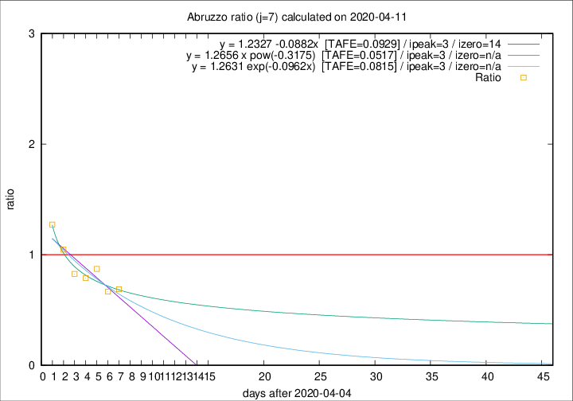

# Abruzzo

Data source: https://raw.githubusercontent.com/pcm-dpc/COVID-19/master/dati-json/dpc-covid19-ita-regioni.json

Delta days analysis (j): 7

Analyses for other values of j for 2020-04-11 are avalable [here](../2020-04-11/README.md)

Analyses for Abruzzo for previous dates are avalable [here](../README.md)

## Fitting 
|fit type|best fit equation|tafe|tfe|ipeak|izero|
|-------|-----|--------|------|---|---|
|linear|y = 1.2327 -0.0882x  [TAFE=0.0929]|0.0929|0.0076|3|14|
|exp|y = 1.2631 exp(-0.0962x)  [TAFE=0.0815]|0.0815|0.0040|3|n/a|
|pow|y = 1.2656 x pow(-0.3175)  [TAFE=0.0517]|0.0517|0.0023|3|n/a|

## Data
|Date|Daily deaths|Cumulated deaths|Deaths in the last 7 days|Deaths in the 7 days before|ratio|
|----|----------|-----------|-------|--------------------|-----|
|2020-04-11|8|206|53|77|0.6883|
|2020-04-10|4|198|52|78|0.6667|
|2020-04-09|15|194|61|70|0.8714|
|2020-04-08|7|179|56|71|0.7887|
|2020-04-07|3|172|57|69|0.8261|
|2020-04-06|11|169|67|64|1.0469|
|2020-04-05|5|158|70|55|1.2727|

[Download data as CSV](COVID-19_abruzzo_j7_2020-04-11.csv)

Generated April 19th, 2020 at 18:42:39 UTC+0200 with https://github.com/robianc/COVID-19
