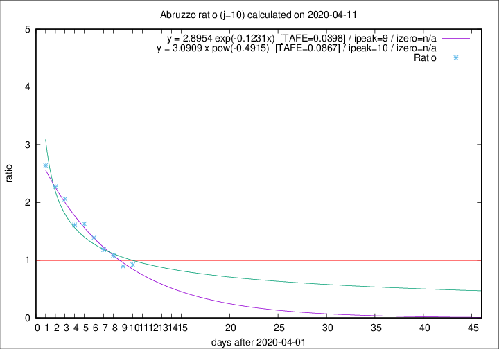

# Abruzzo

Data source: https://raw.githubusercontent.com/pcm-dpc/COVID-19/master/dati-json/dpc-covid19-ita-regioni.json

Estimates in this page were made on 12/4/2020 with data available until 11/04/2020.

## Summary 

### Peak estimate 
|j|linear [TAFE]|exponential [TAFE]|power law [TAFE]|details|
|---|----|-----------|---------|-------|
|7|8/4/2020 [TAFE=0.0929]|8/4/2020 [TAFE=0.0815]|8/4/2020 [TAFE=0.0517]|[analysis](COVID-19_abruzzo_j7_2020-04-11.md)|
|8|9/4/2020 [TAFE=0.0680]|9/4/2020 [TAFE=0.0523]|8/4/2020 [TAFE=0.0697]|[analysis](COVID-19_abruzzo_j8_2020-04-11.md)|
|9|10/4/2020 [TAFE=0.0692]|10/4/2020 [TAFE=0.0450]|10/4/2020 [TAFE=0.0637]|[analysis](COVID-19_abruzzo_j9_2020-04-11.md)|
|10|11/4/2020 [TAFE=0.0666]|11/4/2020 [TAFE=0.0398]|12/4/2020 [TAFE=0.0867]|[analysis](COVID-19_abruzzo_j10_2020-04-11.md)|
|11|11/4/2020 [TAFE=0.1552]|12/4/2020 [TAFE=0.0545]|15/4/2020 [TAFE=0.0994]|[analysis](COVID-19_abruzzo_j11_2020-04-11.md)|
|12|11/4/2020 [TAFE=0.3405]|13/4/2020 [TAFE=0.1059]|17/4/2020 [TAFE=0.0829]|[analysis](COVID-19_abruzzo_j12_2020-04-11.md)|
|13|10/4/2020 [TAFE=0.5783]|13/4/2020 [TAFE=0.1598]|20/4/2020 [TAFE=0.1434]|[analysis](COVID-19_abruzzo_j13_2020-04-11.md)|
|14|10/4/2020 [TAFE=0.7250]|14/4/2020 [TAFE=0.1430]|25/4/2020 [TAFE=0.2406]|[analysis](COVID-19_abruzzo_j14_2020-04-11.md)|

Best estimator is exp with j=10 (TAFE=0.0398)
Corresponding peak date estimate is 11/4/2020 (ipeak 9)

Peak date range estimate: 5/4/2020 - 29/4/2020

### End estimate 
|j|linear [TAFE/TFE]|exponential [TAFE/TFE]|power law [TAFE/TFE]|details|
|---|----|-----------|---------|-------|
|7|19/4/2020 [TAFE=0.0929]|-|-|[analysis](COVID-19_abruzzo_j7_2020-04-11.md)|
|8|18/4/2020 [TAFE=0.0680]|-|-|[analysis](COVID-19_abruzzo_j8_2020-04-11.md)|
|9|-|-|-|[analysis](COVID-19_abruzzo_j9_2020-04-11.md)|
|10|16/4/2020 [TAFE=0.0666]|-|-|[analysis](COVID-19_abruzzo_j10_2020-04-11.md)|
|11|-|-|-|[analysis](COVID-19_abruzzo_j11_2020-04-11.md)|
|12|-|-|-|[analysis](COVID-19_abruzzo_j12_2020-04-11.md)|
|13|-|-|-|[analysis](COVID-19_abruzzo_j13_2020-04-11.md)|
|14|-|-|-|[analysis](COVID-19_abruzzo_j14_2020-04-11.md)|

Best estimator is linear with j=10 (TAFE=0.0666)
Corresponding end date estimate is 16/4/2020 (izero 14)

End date range estimate: 2/4/2020 - 17/4/2020

Generated April 12th, 2020 at 17:02:01 UTC+0200 with https://github.com/robianc/COVID-19
