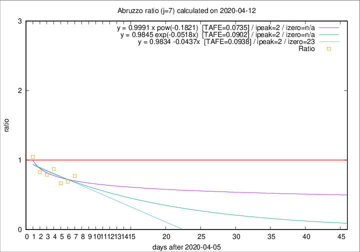

# Abruzzo

Data source: https://raw.githubusercontent.com/pcm-dpc/COVID-19/master/dati-json/dpc-covid19-ita-regioni.json

Delta days analysis (j): 7

Analyses for other values of j for 2020-04-12 are avalable [here](../2020-04-12/README.md)

Analyses for Abruzzo for previous dates are avalable [here](../README.md)

## Fitting 
|fit type|best fit equation|tafe|tfe|ipeak|izero|
|-------|-----|--------|------|---|---|
|linear|y = 0.9834 -0.0437x  [TAFE=0.0938]|0.0938|0.0092|reached|23|
|exp|y = 0.9845 exp(-0.0518x)  [TAFE=0.0902]|0.0902|0.0043|reached|n/a|
|pow|y = 0.9991 x pow(-0.1821)  [TAFE=0.0735]|0.0735|0.0032|reached|n/a|

## Data
|Date|Daily deaths|Cumulated deaths|Deaths in the last 7 days|Deaths in the 7 days before|ratio|
|----|----------|-----------|-------|--------------------|-----|
|2020-04-12|6|212|54|70|0.7714|
|2020-04-11|8|206|53|77|0.6883|
|2020-04-10|4|198|52|78|0.6667|
|2020-04-09|15|194|61|70|0.8714|
|2020-04-08|7|179|56|71|0.7887|
|2020-04-07|3|172|57|69|0.8261|
|2020-04-06|11|169|67|64|1.0469|

[Download data as CSV](COVID-19_abruzzo_j7_2020-04-12.csv)

Generated April 12th, 2020 at 17:02:01 UTC+0200 with https://github.com/robianc/COVID-19
