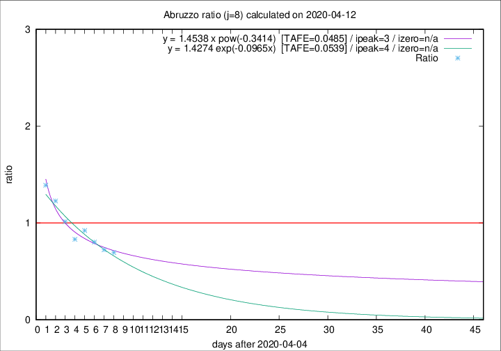

# Abruzzo

Data source: https://raw.githubusercontent.com/pcm-dpc/COVID-19/master/dati-json/dpc-covid19-ita-regioni.json

Delta days analysis (j): 8

Analyses for other values of j for 2020-04-12 are avalable [here](../2020-04-12/README.md)

Analyses for Abruzzo for previous dates are avalable [here](../README.md)

## Fitting 
|fit type|best fit equation|tafe|tfe|ipeak|izero|
|-------|-----|--------|------|---|---|
|exp|y = 1.4274 exp(-0.0965x)  [TAFE=0.0539]|0.0539|0.0025|4|n/a|
|pow|y = 1.4538 x pow(-0.3414)  [TAFE=0.0485]|0.0485|0.0016|3|n/a|

## Data
|Date|Daily deaths|Cumulated deaths|Deaths in the last 8 days|Deaths in the 8 days before|ratio|
|----|----------|-----------|-------|--------------------|-----|
|2020-04-12|6|212|59|85|0.6941|
|2020-04-11|8|206|60|83|0.7229|
|2020-04-10|4|198|65|81|0.8025|
|2020-04-09|15|194|71|77|0.9221|
|2020-04-08|7|179|64|77|0.8312|
|2020-04-07|3|172|70|69|1.0145|
|2020-04-06|11|169|81|66|1.2273|
|2020-04-05|5|158|82|59|1.3898|

[Download data as CSV](COVID-19_abruzzo_j8_2020-04-12.csv)

Generated April 16th, 2020 at 20:09:19 UTC+0200 with https://github.com/robianc/COVID-19
