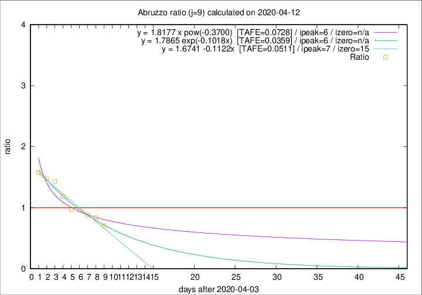

# Abruzzo

Data source: https://raw.githubusercontent.com/pcm-dpc/COVID-19/master/dati-json/dpc-covid19-ita-regioni.json

Delta days analysis (j): 9

Analyses for other values of j for 2020-04-12 are avalable [here](../2020-04-12/README.md)

Analyses for Abruzzo for previous dates are avalable [here](../README.md)

## Fitting 
|fit type|best fit equation|tafe|tfe|ipeak|izero|
|-------|-----|--------|------|---|---|
|linear|y = 1.6741 -0.1122x  [TAFE=0.0511]|0.0511|0.0018|7|15|
|exp|y = 1.7865 exp(-0.1018x)  [TAFE=0.0359]|0.0359|0.0012|6|n/a|
|pow|y = 1.8177 x pow(-0.3700)  [TAFE=0.0728]|0.0728|0.0043|6|n/a|

## Data
|Date|Daily deaths|Cumulated deaths|Deaths in the last 9 days|Deaths in the 9 days before|ratio|
|----|----------|-----------|-------|--------------------|-----|
|2020-04-12|6|212|66|94|0.7021|
|2020-04-11|8|206|73|87|0.8391|
|2020-04-10|4|198|75|85|0.8824|
|2020-04-09|15|194|79|82|0.9634|
|2020-04-08|7|179|77|80|0.9625|
|2020-04-07|3|172|84|71|1.1831|
|2020-04-06|11|169|93|65|1.4308|
|2020-04-05|5|158|90|61|1.4754|
|2020-04-04|7|153|90|57|1.5789|

[Download data as CSV](COVID-19_abruzzo_j9_2020-04-12.csv)

Generated April 12th, 2020 at 17:02:01 UTC+0200 with https://github.com/robianc/COVID-19
