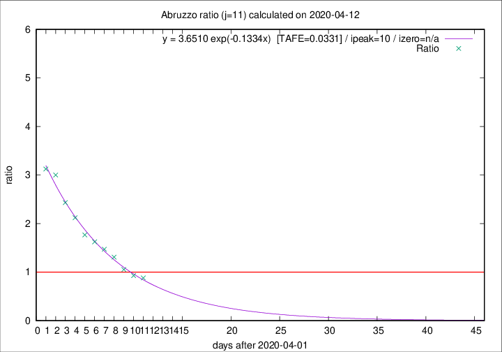

# Abruzzo

Data source: https://raw.githubusercontent.com/pcm-dpc/COVID-19/master/dati-json/dpc-covid19-ita-regioni.json

Estimates in this page were made on 12/4/2020 with data available until 12/04/2020.

## Summary 

### Peak estimate 
|j|linear [TAFE]|exponential [TAFE]|power law [TAFE]|details|
|---|----|-----------|---------|-------|
|7|8/4/2020 [TAFE=0.0938]|8/4/2020 [TAFE=0.0902]|8/4/2020 [TAFE=0.0735]|[analysis](COVID-19_abruzzo_j7_2020-04-12.md)|
|8|9/4/2020 [TAFE=0.0670]|9/4/2020 [TAFE=0.0539]|8/4/2020 [TAFE=0.0485]|[analysis](COVID-19_abruzzo_j8_2020-04-12.md)|
|9|11/4/2020 [TAFE=0.0511]|10/4/2020 [TAFE=0.0359]|10/4/2020 [TAFE=0.0728]|[analysis](COVID-19_abruzzo_j9_2020-04-12.md)|
|10|11/4/2020 [TAFE=0.0867]|11/4/2020 [TAFE=0.0490]|12/4/2020 [TAFE=0.0786]|[analysis](COVID-19_abruzzo_j10_2020-04-12.md)|
|11|12/4/2020 [TAFE=0.0866]|12/4/2020 [TAFE=0.0331]|14/4/2020 [TAFE=0.1277]|[analysis](COVID-19_abruzzo_j11_2020-04-12.md)|
|12|12/4/2020 [TAFE=0.2358]|13/4/2020 [TAFE=0.0747]|17/4/2020 [TAFE=0.1112]|[analysis](COVID-19_abruzzo_j12_2020-04-12.md)|
|13|11/4/2020 [TAFE=0.5658]|13/4/2020 [TAFE=0.1537]|18/4/2020 [TAFE=0.0886]|[analysis](COVID-19_abruzzo_j13_2020-04-12.md)|
|14|11/4/2020 [TAFE=0.7534]|14/4/2020 [TAFE=0.1663]|22/4/2020 [TAFE=0.1724]|[analysis](COVID-19_abruzzo_j14_2020-04-12.md)|

Best estimator is exp with j=11 (TAFE=0.0331)
Corresponding peak date estimate is 12/4/2020 (ipeak 10)

Peak date range estimate: 4/4/2020 - 25/4/2020

### End estimate 
|j|linear [TAFE/TFE]|exponential [TAFE/TFE]|power law [TAFE/TFE]|details|
|---|----|-----------|---------|-------|
|7|29/4/2020 [TAFE=0.0938]|-|-|[analysis](COVID-19_abruzzo_j7_2020-04-12.md)|
|8|20/4/2020 [TAFE=0.0670]|-|-|[analysis](COVID-19_abruzzo_j8_2020-04-12.md)|
|9|19/4/2020 [TAFE=0.0511]|-|-|[analysis](COVID-19_abruzzo_j9_2020-04-12.md)|
|10|-|-|-|[analysis](COVID-19_abruzzo_j10_2020-04-12.md)|
|11|-|-|-|[analysis](COVID-19_abruzzo_j11_2020-04-12.md)|
|12|-|-|-|[analysis](COVID-19_abruzzo_j12_2020-04-12.md)|
|13|-|-|-|[analysis](COVID-19_abruzzo_j13_2020-04-12.md)|
|14|-|-|-|[analysis](COVID-19_abruzzo_j14_2020-04-12.md)|

Best estimator is linear with j=9 (TAFE=0.0511)
Corresponding end date estimate is 19/4/2020 (izero 15)

End date range estimate: 4/4/2020 - 27/4/2020

Generated April 12th, 2020 at 16:28:18 UTC+0200 with https://github.com/robianc/COVID-19
