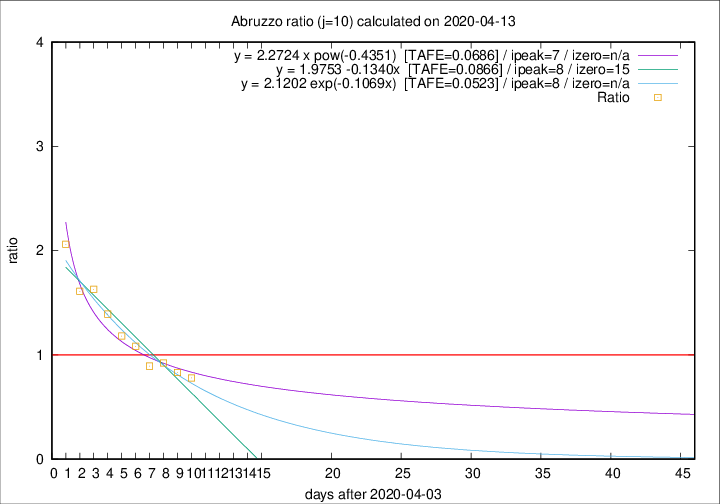

# Abruzzo

Data source: https://raw.githubusercontent.com/pcm-dpc/COVID-19/master/dati-json/dpc-covid19-ita-regioni.json

Delta days analysis (j): 10

Analyses for other values of j for 2020-04-13 are avalable [here](../2020-04-13/README.md)

Analyses for Abruzzo for previous dates are avalable [here](../README.md)

## Fitting 
|fit type|best fit equation|tafe|tfe|ipeak|izero|
|-------|-----|--------|------|---|---|
|linear|y = 1.9753 -0.1340x  [TAFE=0.0866]|0.0866|0.0022|8|15|
|exp|y = 2.1202 exp(-0.1069x)  [TAFE=0.0523]|0.0523|0.0018|8|n/a|
|pow|y = 2.2724 x pow(-0.4351)  [TAFE=0.0686]|0.0686|0.0031|7|n/a|

## Data
|Date|Daily deaths|Cumulated deaths|Deaths in the last 10 days|Deaths in the 10 days before|ratio|
|----|----------|-----------|-------|--------------------|-----|
|2020-04-13|12|224|78|100|0.7800|
|2020-04-12|6|212|79|95|0.8316|
|2020-04-11|8|206|83|90|0.9222|
|2020-04-10|4|198|83|93|0.8925|
|2020-04-09|15|194|92|85|1.0824|
|2020-04-08|7|179|91|77|1.1818|
|2020-04-07|3|172|96|69|1.3913|
|2020-04-06|11|169|101|62|1.6290|
|2020-04-05|5|158|95|59|1.6102|
|2020-04-04|7|153|101|49|2.0612|

[Download data as CSV](COVID-19_abruzzo_j10_2020-04-13.csv)

Generated April 19th, 2020 at 18:42:39 UTC+0200 with https://github.com/robianc/COVID-19
