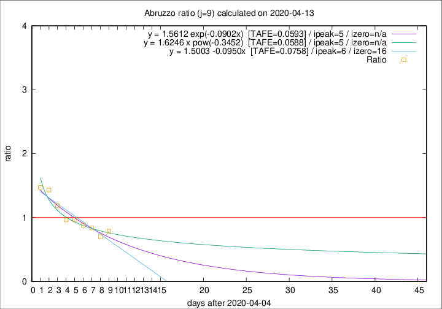

# Abruzzo

Data source: https://raw.githubusercontent.com/pcm-dpc/COVID-19/master/dati-json/dpc-covid19-ita-regioni.json

Delta days analysis (j): 9

Analyses for other values of j for 2020-04-13 are avalable [here](../2020-04-13/README.md)

Analyses for Abruzzo for previous dates are avalable [here](../README.md)

## Fitting 
|fit type|best fit equation|tafe|tfe|ipeak|izero|
|-------|-----|--------|------|---|---|
|linear|y = 1.5003 -0.0950x  [TAFE=0.0758]|0.0758|0.0051|6|16|
|exp|y = 1.5612 exp(-0.0902x)  [TAFE=0.0593]|0.0593|0.0029|5|n/a|
|pow|y = 1.6246 x pow(-0.3452)  [TAFE=0.0588]|0.0588|0.0025|5|n/a|

## Data
|Date|Daily deaths|Cumulated deaths|Deaths in the last 9 days|Deaths in the 9 days before|ratio|
|----|----------|-----------|-------|--------------------|-----|
|2020-04-13|12|224|71|90|0.7889|
|2020-04-12|6|212|66|94|0.7021|
|2020-04-11|8|206|73|87|0.8391|
|2020-04-10|4|198|75|85|0.8824|
|2020-04-09|15|194|79|82|0.9634|
|2020-04-08|7|179|77|80|0.9625|
|2020-04-07|3|172|84|71|1.1831|
|2020-04-06|11|169|93|65|1.4308|
|2020-04-05|5|158|90|61|1.4754|

[Download data as CSV](COVID-19_abruzzo_j9_2020-04-13.csv)

Generated April 14th, 2020 at 19:16:04 UTC+0200 with https://github.com/robianc/COVID-19
