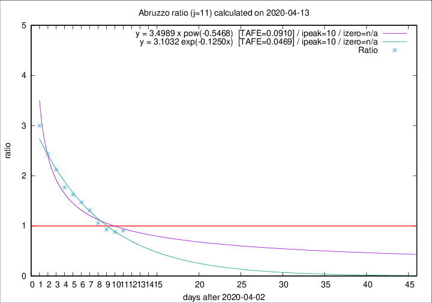
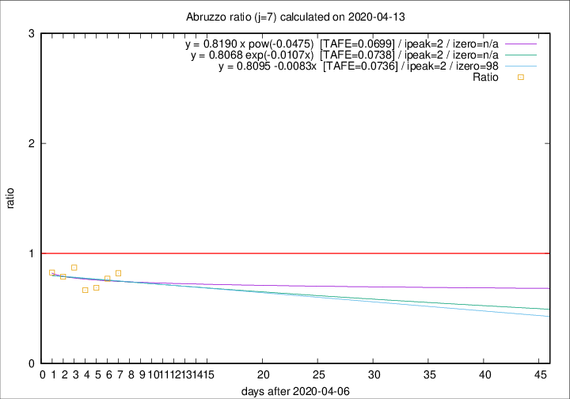

# Abruzzo

Data source: https://raw.githubusercontent.com/pcm-dpc/COVID-19/master/dati-json/dpc-covid19-ita-regioni.json

Estimates in this page were made on 14/4/2020 with data available until 13/04/2020.

## Summary 

### Peak estimate 
|j|linear [TAFE]|exponential [TAFE]|power law [TAFE]|details|
|---|----|-----------|---------|-------|
|7|9/4/2020 [TAFE=0.0736]|9/4/2020 [TAFE=0.0738]|9/4/2020 [TAFE=0.0699]|[analysis](COVID-19_abruzzo_j7_2020-04-13.md)|
|8|9/4/2020 [TAFE=0.0838]|9/4/2020 [TAFE=0.0781]|9/4/2020 [TAFE=0.0569]|[analysis](COVID-19_abruzzo_j8_2020-04-13.md)|
|9|11/4/2020 [TAFE=0.0758]|10/4/2020 [TAFE=0.0593]|10/4/2020 [TAFE=0.0588]|[analysis](COVID-19_abruzzo_j9_2020-04-13.md)|
|10|12/4/2020 [TAFE=0.0866]|12/4/2020 [TAFE=0.0523]|11/4/2020 [TAFE=0.0686]|[analysis](COVID-19_abruzzo_j10_2020-04-13.md)|
|11|12/4/2020 [TAFE=0.1097]|13/4/2020 [TAFE=0.0469]|13/4/2020 [TAFE=0.0910]|[analysis](COVID-19_abruzzo_j11_2020-04-13.md)|
|12|13/4/2020 [TAFE=0.1601]|13/4/2020 [TAFE=0.0637]|16/4/2020 [TAFE=0.1103]|[analysis](COVID-19_abruzzo_j12_2020-04-13.md)|
|13|12/4/2020 [TAFE=0.3856]|14/4/2020 [TAFE=0.1143]|18/4/2020 [TAFE=0.0993]|[analysis](COVID-19_abruzzo_j13_2020-04-13.md)|
|14|12/4/2020 [TAFE=0.6956]|15/4/2020 [TAFE=0.1674]|21/4/2020 [TAFE=0.1380]|[analysis](COVID-19_abruzzo_j14_2020-04-13.md)|

Best estimator is exp with j=11 (TAFE=0.0469)
Corresponding peak date estimate is 13/4/2020 (ipeak 10)

Peak date range estimate: 5/4/2020 - 24/4/2020

### End estimate 
|j|linear [TAFE/TFE]|exponential [TAFE/TFE]|power law [TAFE/TFE]|details|
|---|----|-----------|---------|-------|
|7|14/7/2020 [TAFE=0.0736]|-|-|[analysis](COVID-19_abruzzo_j7_2020-04-13.md)|
|8|-|-|-|[analysis](COVID-19_abruzzo_j8_2020-04-13.md)|
|9|-|-|-|[analysis](COVID-19_abruzzo_j9_2020-04-13.md)|
|10|-|-|-|[analysis](COVID-19_abruzzo_j10_2020-04-13.md)|
|11|-|-|-|[analysis](COVID-19_abruzzo_j11_2020-04-13.md)|
|12|-|-|-|[analysis](COVID-19_abruzzo_j12_2020-04-13.md)|
|13|-|-|-|[analysis](COVID-19_abruzzo_j13_2020-04-13.md)|
|14|-|-|-|[analysis](COVID-19_abruzzo_j14_2020-04-13.md)|

Best estimator is linear with j=7 (TAFE=0.0736)
Corresponding end date estimate is 14/7/2020 (izero 98)

End date range estimate: 7/4/2020 - 14/7/2020

Generated April 14th, 2020 at 19:16:04 UTC+0200 with https://github.com/robianc/COVID-19
