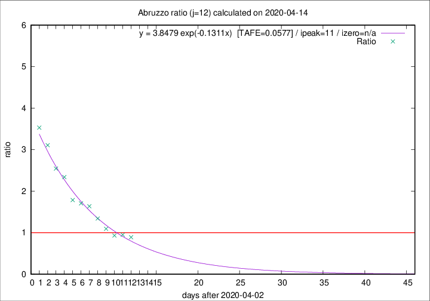

# Abruzzo

Data source: https://raw.githubusercontent.com/pcm-dpc/COVID-19/master/dati-json/dpc-covid19-ita-regioni.json

Delta days analysis (j): 12

Analyses for other values of j for 2020-04-14 are avalable [here](../2020-04-14/README.md)

Analyses for Abruzzo for previous dates are avalable [here](../README.md)

## Fitting 
|fit type|best fit equation|tafe|tfe|ipeak|izero|
|-------|-----|--------|------|---|---|
|exp|y = 3.8479 exp(-0.1311x)  [TAFE=0.0577]|0.0577|0.0025|11|n/a|

## Data
|Date|Daily deaths|Cumulated deaths|Deaths in the last 12 days|Deaths in the 12 days before|ratio|
|----|----------|-----------|-------|--------------------|-----|
|2020-04-14|8|232|99|111|0.8919|
|2020-04-13|12|224|101|106|0.9528|
|2020-04-12|6|212|97|104|0.9327|
|2020-04-11|8|206|104|95|1.0947|
|2020-04-10|4|198|110|82|1.3415|
|2020-04-09|15|194|118|72|1.6389|
|2020-04-08|7|179|111|65|1.7077|
|2020-04-07|3|172|109|61|1.7869|
|2020-04-06|11|169|117|50|2.3400|
|2020-04-05|5|158|112|44|2.5455|
|2020-04-04|7|153|115|37|3.1081|
|2020-04-03|13|146|113|32|3.5312|

[Download data as CSV](COVID-19_abruzzo_j12_2020-04-14.csv)

Generated April 16th, 2020 at 20:09:19 UTC+0200 with https://github.com/robianc/COVID-19
