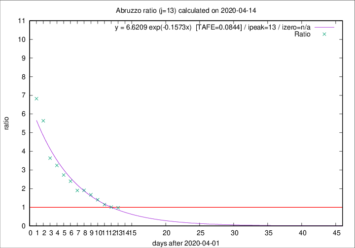

# Abruzzo

Data source: https://raw.githubusercontent.com/pcm-dpc/COVID-19/master/dati-json/dpc-covid19-ita-regioni.json

Delta days analysis (j): 13

Analyses for other values of j for 2020-04-14 are avalable [here](../2020-04-14/README.md)

Analyses for Abruzzo for previous dates are avalable [here](../README.md)

## Fitting 
|fit type|best fit equation|tafe|tfe|ipeak|izero|
|-------|-----|--------|------|---|---|
|exp|y = 6.6209 exp(-0.1573x)  [TAFE=0.0844]|0.0844|0.0052|13|n/a|

## Data
|Date|Daily deaths|Cumulated deaths|Deaths in the last 13 days|Deaths in the 13 days before|ratio|
|----|----------|-----------|-------|--------------------|-----|
|2020-04-14|8|232|109|112|0.9732|
|2020-04-13|12|224|109|108|1.0093|
|2020-04-12|6|212|110|96|1.1458|
|2020-04-11|8|206|118|84|1.4048|
|2020-04-10|4|198|122|73|1.6712|
|2020-04-09|15|194|126|66|1.9091|
|2020-04-08|7|179|116|61|1.9016|
|2020-04-07|3|172|120|50|2.4000|
|2020-04-06|11|169|123|45|2.7333|
|2020-04-05|5|158|120|37|3.2432|
|2020-04-04|7|153|120|33|3.6364|
|2020-04-03|13|146|124|22|5.6364|
|2020-04-02|10|133|116|17|6.8235|

[Download data as CSV](COVID-19_abruzzo_j13_2020-04-14.csv)

Generated April 16th, 2020 at 20:09:19 UTC+0200 with https://github.com/robianc/COVID-19
