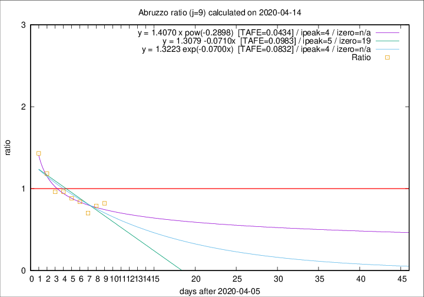
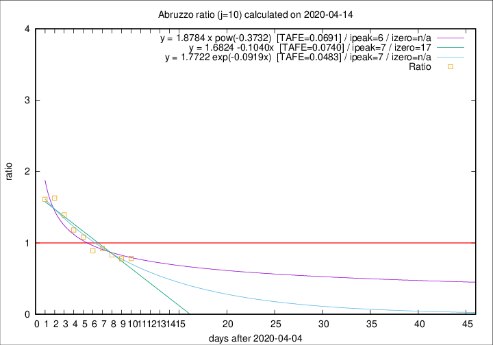

# Abruzzo

Data source: https://raw.githubusercontent.com/pcm-dpc/COVID-19/master/dati-json/dpc-covid19-ita-regioni.json

Estimates in this page were made on 19/4/2020 with data available until 14/04/2020.

## Summary 

### Peak estimate 
|j|linear [TAFE]|exponential [TAFE]|power law [TAFE]|details|
|---|----|-----------|---------|-------|
|7|10/4/2020 [TAFE=0.1222]|10/4/2020 [TAFE=0.1165]|10/4/2020 [TAFE=0.1158]|[analysis](COVID-19_abruzzo_j7_2020-04-14.md)|
|8|9/4/2020 [TAFE=0.0818]|9/4/2020 [TAFE=0.0791]|9/4/2020 [TAFE=0.0639]|[analysis](COVID-19_abruzzo_j8_2020-04-14.md)|
|9|11/4/2020 [TAFE=0.0983]|10/4/2020 [TAFE=0.0832]|10/4/2020 [TAFE=0.0434]|[analysis](COVID-19_abruzzo_j9_2020-04-14.md)|
|10|12/4/2020 [TAFE=0.0740]|12/4/2020 [TAFE=0.0483]|11/4/2020 [TAFE=0.0691]|[analysis](COVID-19_abruzzo_j10_2020-04-14.md)|
|11|13/4/2020 [TAFE=0.1047]|13/4/2020 [TAFE=0.0526]|13/4/2020 [TAFE=0.0857]|[analysis](COVID-19_abruzzo_j11_2020-04-14.md)|
|12|13/4/2020 [TAFE=0.1296]|14/4/2020 [TAFE=0.0577]|15/4/2020 [TAFE=0.1213]|[analysis](COVID-19_abruzzo_j12_2020-04-14.md)|
|13|13/4/2020 [TAFE=0.2669]|15/4/2020 [TAFE=0.0844]|18/4/2020 [TAFE=0.1129]|[analysis](COVID-19_abruzzo_j13_2020-04-14.md)|
|14|13/4/2020 [TAFE=0.6345]|15/4/2020 [TAFE=0.1499]|20/4/2020 [TAFE=0.0970]|[analysis](COVID-19_abruzzo_j14_2020-04-14.md)|

Best estimator is pow with j=9 (TAFE=0.0434)
Corresponding peak date estimate is 10/4/2020 (ipeak 4)

Peak date range estimate: 8/4/2020 - 25/4/2020

### End estimate 
|j|linear [TAFE/TFE]|exponential [TAFE/TFE]|power law [TAFE/TFE]|details|
|---|----|-----------|---------|-------|
|7|-|-|-|[analysis](COVID-19_abruzzo_j7_2020-04-14.md)|
|8|9/5/2020 [TAFE=0.0818]|-|-|[analysis](COVID-19_abruzzo_j8_2020-04-14.md)|
|9|-|-|-|[analysis](COVID-19_abruzzo_j9_2020-04-14.md)|
|10|22/4/2020 [TAFE=0.0740]|-|-|[analysis](COVID-19_abruzzo_j10_2020-04-14.md)|
|11|-|-|-|[analysis](COVID-19_abruzzo_j11_2020-04-14.md)|
|12|-|-|-|[analysis](COVID-19_abruzzo_j12_2020-04-14.md)|
|13|-|-|-|[analysis](COVID-19_abruzzo_j13_2020-04-14.md)|
|14|-|-|-|[analysis](COVID-19_abruzzo_j14_2020-04-14.md)|

Best estimator is linear with j=10 (TAFE=0.0740)
Corresponding end date estimate is 22/4/2020 (izero 17)

End date range estimate: 5/4/2020 - 7/5/2020

Generated April 19th, 2020 at 18:42:39 UTC+0200 with https://github.com/robianc/COVID-19
