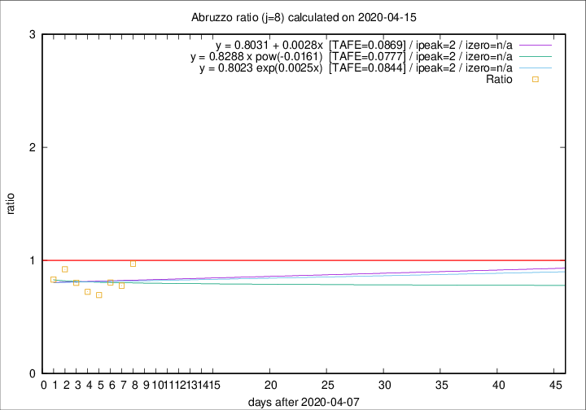

# Abruzzo

Data source: https://raw.githubusercontent.com/pcm-dpc/COVID-19/master/dati-json/dpc-covid19-ita-regioni.json

Delta days analysis (j): 8

Analyses for other values of j for 2020-04-15 are avalable [here](../2020-04-15/README.md)

Analyses for Abruzzo for previous dates are avalable [here](../README.md)

## Fitting 
|fit type|best fit equation|tafe|tfe|ipeak|izero|
|-------|-----|--------|------|---|---|
|linear|y = 0.8031 + 0.0028x  [TAFE=0.0869]|0.0869|0.0110|2|n/a|
|exp|y = 0.8023 exp(0.0025x)  [TAFE=0.0844]|0.0844|0.0056|2|n/a|
|pow|y = 0.8288 x pow(-0.0161)  [TAFE=0.0777]|0.0777|0.0055|2|n/a|

## Data
|Date|Daily deaths|Cumulated deaths|Deaths in the last 8 days|Deaths in the 8 days before|ratio|
|----|----------|-----------|-------|--------------------|-----|
|2020-04-15|8|240|68|70|0.9714|
|2020-04-14|8|232|63|81|0.7778|
|2020-04-13|12|224|66|82|0.8049|
|2020-04-12|6|212|59|85|0.6941|
|2020-04-11|8|206|60|83|0.7229|
|2020-04-10|4|198|65|81|0.8025|
|2020-04-09|15|194|71|77|0.9221|
|2020-04-08|7|179|64|77|0.8312|

[Download data as CSV](COVID-19_abruzzo_j8_2020-04-15.csv)

Generated April 19th, 2020 at 18:42:39 UTC+0200 with https://github.com/robianc/COVID-19
