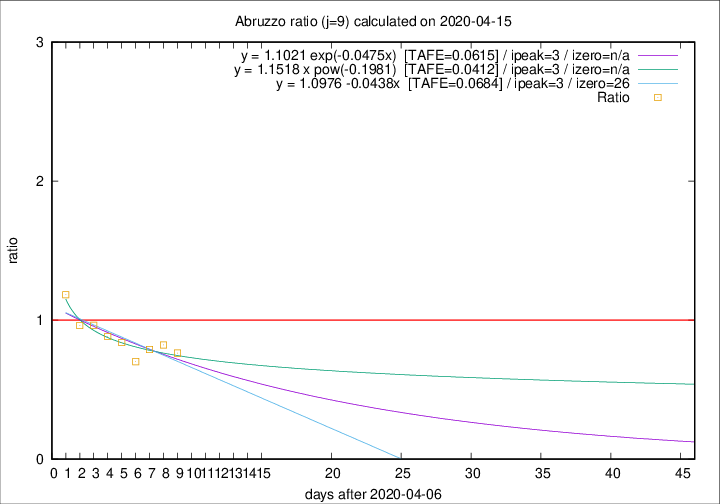

# Abruzzo

Data source: https://raw.githubusercontent.com/pcm-dpc/COVID-19/master/dati-json/dpc-covid19-ita-regioni.json

Delta days analysis (j): 9

Analyses for other values of j for 2020-04-15 are avalable [here](../2020-04-15/README.md)

Analyses for Abruzzo for previous dates are avalable [here](../README.md)

## Fitting 
|fit type|best fit equation|tafe|tfe|ipeak|izero|
|-------|-----|--------|------|---|---|
|linear|y = 1.0976 -0.0438x  [TAFE=0.0684]|0.0684|0.0064|3|26|
|exp|y = 1.1021 exp(-0.0475x)  [TAFE=0.0615]|0.0615|0.0034|3|n/a|
|pow|y = 1.1518 x pow(-0.1981)  [TAFE=0.0412]|0.0412|0.0017|3|n/a|

## Data
|Date|Daily deaths|Cumulated deaths|Deaths in the last 9 days|Deaths in the 9 days before|ratio|
|----|----------|-----------|-------|--------------------|-----|
|2020-04-15|8|240|71|93|0.7634|
|2020-04-14|8|232|74|90|0.8222|
|2020-04-13|12|224|71|90|0.7889|
|2020-04-12|6|212|66|94|0.7021|
|2020-04-11|8|206|73|87|0.8391|
|2020-04-10|4|198|75|85|0.8824|
|2020-04-09|15|194|79|82|0.9634|
|2020-04-08|7|179|77|80|0.9625|
|2020-04-07|3|172|84|71|1.1831|

[Download data as CSV](COVID-19_abruzzo_j9_2020-04-15.csv)

Generated April 16th, 2020 at 20:09:19 UTC+0200 with https://github.com/robianc/COVID-19
