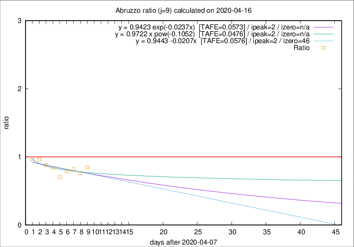

# Abruzzo

Data source: https://raw.githubusercontent.com/pcm-dpc/COVID-19/master/dati-json/dpc-covid19-ita-regioni.json

Estimates in this page were made on 19/4/2020 with data available until 16/04/2020.

## Summary 

### Peak estimate 
|j|linear [TAFE]|exponential [TAFE]|power law [TAFE]|details|
|---|----|-----------|---------|-------|
|7|12/4/2020 [TAFE=0.0949]|12/4/2020 [TAFE=0.0925]|12/4/2020 [TAFE=0.0999]|[analysis](COVID-19_abruzzo_j7_2020-04-16.md)|
|8|11/4/2020 [TAFE=0.1052]|11/4/2020 [TAFE=0.1035]|11/4/2020 [TAFE=0.1115]|[analysis](COVID-19_abruzzo_j8_2020-04-16.md)|
|9|10/4/2020 [TAFE=0.0576]|10/4/2020 [TAFE=0.0573]|10/4/2020 [TAFE=0.0476]|[analysis](COVID-19_abruzzo_j9_2020-04-16.md)|
|10|12/4/2020 [TAFE=0.0824]|12/4/2020 [TAFE=0.0683]|11/4/2020 [TAFE=0.0398]|[analysis](COVID-19_abruzzo_j10_2020-04-16.md)|
|11|14/4/2020 [TAFE=0.1000]|13/4/2020 [TAFE=0.0757]|12/4/2020 [TAFE=0.0616]|[analysis](COVID-19_abruzzo_j11_2020-04-16.md)|
|12|15/4/2020 [TAFE=0.1263]|14/4/2020 [TAFE=0.0674]|14/4/2020 [TAFE=0.0897]|[analysis](COVID-19_abruzzo_j12_2020-04-16.md)|
|13|15/4/2020 [TAFE=0.1424]|15/4/2020 [TAFE=0.0447]|17/4/2020 [TAFE=0.1320]|[analysis](COVID-19_abruzzo_j13_2020-04-16.md)|
|14|15/4/2020 [TAFE=0.3105]|16/4/2020 [TAFE=0.0869]|19/4/2020 [TAFE=0.1159]|[analysis](COVID-19_abruzzo_j14_2020-04-16.md)|

Best estimator is pow with j=10 (TAFE=0.0398)
Corresponding peak date estimate is 11/4/2020 (ipeak 4)

Peak date range estimate: 9/4/2020 - 23/4/2020

### End estimate 
|j|linear [TAFE/TFE]|exponential [TAFE/TFE]|power law [TAFE/TFE]|details|
|---|----|-----------|---------|-------|
|7|-|-|-|[analysis](COVID-19_abruzzo_j7_2020-04-16.md)|
|8|-|-|-|[analysis](COVID-19_abruzzo_j8_2020-04-16.md)|
|9|24/5/2020 [TAFE=0.0576]|-|-|[analysis](COVID-19_abruzzo_j9_2020-04-16.md)|
|10|-|-|-|[analysis](COVID-19_abruzzo_j10_2020-04-16.md)|
|11|-|-|-|[analysis](COVID-19_abruzzo_j11_2020-04-16.md)|
|12|-|-|-|[analysis](COVID-19_abruzzo_j12_2020-04-16.md)|
|13|-|-|-|[analysis](COVID-19_abruzzo_j13_2020-04-16.md)|
|14|-|-|-|[analysis](COVID-19_abruzzo_j14_2020-04-16.md)|

Best estimator is linear with j=9 (TAFE=0.0576)
Corresponding end date estimate is 24/5/2020 (izero 46)

End date range estimate: 8/4/2020 - 24/5/2020

Generated April 19th, 2020 at 18:42:39 UTC+0200 with https://github.com/robianc/COVID-19
