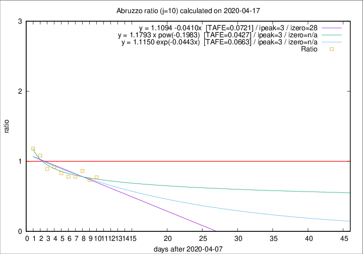

# Abruzzo

Data source: https://raw.githubusercontent.com/pcm-dpc/COVID-19/master/dati-json/dpc-covid19-ita-regioni.json

Delta days analysis (j): 10

Analyses for other values of j for 2020-04-17 are avalable [here](../2020-04-17/README.md)

Analyses for Abruzzo for previous dates are avalable [here](../README.md)

## Fitting 
|fit type|best fit equation|tafe|tfe|ipeak|izero|
|-------|-----|--------|------|---|---|
|linear|y = 1.1094 -0.0410x  [TAFE=0.0721]|0.0721|0.0053|3|28|
|exp|y = 1.1150 exp(-0.0443x)  [TAFE=0.0663]|0.0663|0.0024|3|n/a|
|pow|y = 1.1793 x pow(-0.1983)  [TAFE=0.0427]|0.0427|0.0012|3|n/a|

## Data
|Date|Daily deaths|Cumulated deaths|Deaths in the last 10 days|Deaths in the 10 days before|ratio|
|----|----------|-----------|-------|--------------------|-----|
|2020-04-17|3|246|74|96|0.7708|
|2020-04-16|3|243|74|101|0.7327|
|2020-04-15|8|240|82|95|0.8632|
|2020-04-14|8|232|79|101|0.7822|
|2020-04-13|12|224|78|100|0.7800|
|2020-04-12|6|212|79|95|0.8316|
|2020-04-11|8|206|83|90|0.9222|
|2020-04-10|4|198|83|93|0.8925|
|2020-04-09|15|194|92|85|1.0824|
|2020-04-08|7|179|91|77|1.1818|

[Download data as CSV](COVID-19_abruzzo_j10_2020-04-17.csv)

Generated April 19th, 2020 at 18:42:39 UTC+0200 with https://github.com/robianc/COVID-19
