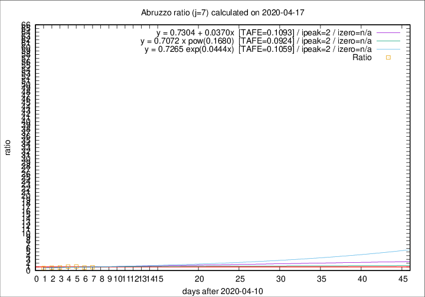

# Abruzzo

Data source: https://raw.githubusercontent.com/pcm-dpc/COVID-19/master/dati-json/dpc-covid19-ita-regioni.json

Delta days analysis (j): 7

Analyses for other values of j for 2020-04-17 are avalable [here](../2020-04-17/README.md)

Analyses for Abruzzo for previous dates are avalable [here](../README.md)

## Fitting 
|fit type|best fit equation|tafe|tfe|ipeak|izero|
|-------|-----|--------|------|---|---|
|linear|y = 0.7304 + 0.0370x  [TAFE=0.1093]|0.1093|0.0164|2|n/a|
|exp|y = 0.7265 exp(0.0444x)  [TAFE=0.1059]|0.1059|0.0079|2|n/a|
|pow|y = 0.7072 x pow(0.1680)  [TAFE=0.0924]|0.0924|0.0063|2|n/a|

## Data
|Date|Daily deaths|Cumulated deaths|Deaths in the last 7 days|Deaths in the 7 days before|ratio|
|----|----------|-----------|-------|--------------------|-----|
|2020-04-17|3|246|48|52|0.9231|
|2020-04-16|3|243|49|61|0.8033|
|2020-04-15|8|240|61|56|1.0893|
|2020-04-14|8|232|60|57|1.0526|
|2020-04-13|12|224|55|67|0.8209|
|2020-04-12|6|212|54|70|0.7714|
|2020-04-11|8|206|53|77|0.6883|

[Download data as CSV](COVID-19_abruzzo_j7_2020-04-17.csv)

Generated April 19th, 2020 at 18:42:39 UTC+0200 with https://github.com/robianc/COVID-19
