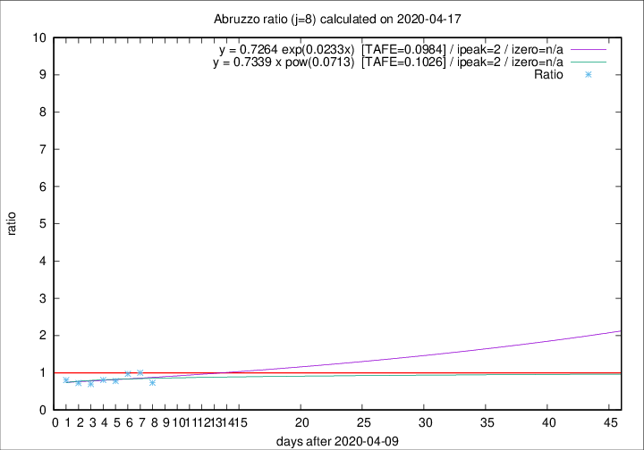

# Abruzzo

Data source: https://raw.githubusercontent.com/pcm-dpc/COVID-19/master/dati-json/dpc-covid19-ita-regioni.json

Delta days analysis (j): 8

Analyses for other values of j for 2020-04-17 are avalable [here](../2020-04-17/README.md)

Analyses for Abruzzo for previous dates are avalable [here](../README.md)

## Fitting 
|fit type|best fit equation|tafe|tfe|ipeak|izero|
|-------|-----|--------|------|---|---|
|exp|y = 0.7264 exp(0.0233x)  [TAFE=0.0984]|0.0984|0.0065|2|n/a|
|pow|y = 0.7339 x pow(0.0713)  [TAFE=0.1026]|0.1026|0.0067|2|n/a|

## Data
|Date|Daily deaths|Cumulated deaths|Deaths in the last 8 days|Deaths in the 8 days before|ratio|
|----|----------|-----------|-------|--------------------|-----|
|2020-04-17|3|246|52|71|0.7324|
|2020-04-16|3|243|64|64|1.0000|
|2020-04-15|8|240|68|70|0.9714|
|2020-04-14|8|232|63|81|0.7778|
|2020-04-13|12|224|66|82|0.8049|
|2020-04-12|6|212|59|85|0.6941|
|2020-04-11|8|206|60|83|0.7229|
|2020-04-10|4|198|65|81|0.8025|

[Download data as CSV](COVID-19_abruzzo_j8_2020-04-17.csv)

Generated April 19th, 2020 at 18:42:39 UTC+0200 with https://github.com/robianc/COVID-19
