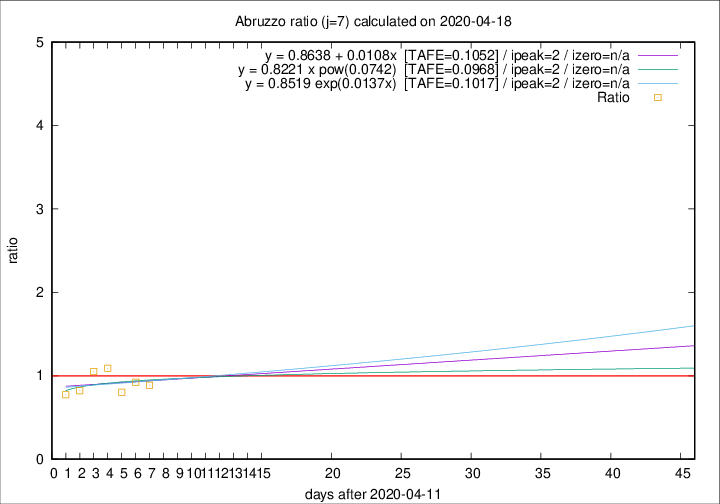

# Abruzzo

Data source: https://raw.githubusercontent.com/pcm-dpc/COVID-19/master/dati-json/dpc-covid19-ita-regioni.json

Delta days analysis (j): 7

Analyses for other values of j for 2020-04-18 are avalable [here](../2020-04-18/README.md)

Analyses for Abruzzo for previous dates are avalable [here](../README.md)

## Fitting 
|fit type|best fit equation|tafe|tfe|ipeak|izero|
|-------|-----|--------|------|---|---|
|linear|y = 0.8638 + 0.0108x  [TAFE=0.1052]|0.1052|0.0149|2|n/a|
|exp|y = 0.8519 exp(0.0137x)  [TAFE=0.1017]|0.1017|0.0072|2|n/a|
|pow|y = 0.8221 x pow(0.0742)  [TAFE=0.0968]|0.0968|0.0065|2|n/a|

## Data
|Date|Daily deaths|Cumulated deaths|Deaths in the last 7 days|Deaths in the 7 days before|ratio|
|----|----------|-----------|-------|--------------------|-----|
|2020-04-18|7|253|47|53|0.8868|
|2020-04-17|3|246|48|52|0.9231|
|2020-04-16|3|243|49|61|0.8033|
|2020-04-15|8|240|61|56|1.0893|
|2020-04-14|8|232|60|57|1.0526|
|2020-04-13|12|224|55|67|0.8209|
|2020-04-12|6|212|54|70|0.7714|

[Download data as CSV](COVID-19_abruzzo_j7_2020-04-18.csv)

Generated April 19th, 2020 at 18:42:39 UTC+0200 with https://github.com/robianc/COVID-19
