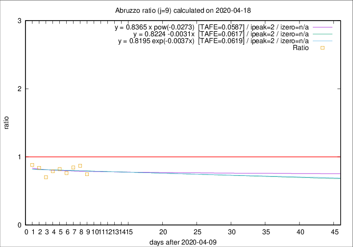

# Abruzzo

Data source: https://raw.githubusercontent.com/pcm-dpc/COVID-19/master/dati-json/dpc-covid19-ita-regioni.json

Delta days analysis (j): 9

Analyses for other values of j for 2020-04-18 are avalable [here](../2020-04-18/README.md)

Analyses for Abruzzo for previous dates are avalable [here](../README.md)

## Fitting 
|fit type|best fit equation|tafe|tfe|ipeak|izero|
|-------|-----|--------|------|---|---|
|linear|y = 0.8224 -0.0031x  [TAFE=0.0617]|0.0617|0.0053|2|n/a|
|exp|y = 0.8195 exp(-0.0037x)  [TAFE=0.0619]|0.0619|0.0024|2|n/a|
|pow|y = 0.8365 x pow(-0.0273)  [TAFE=0.0587]|0.0587|0.0024|2|n/a|

## Data
|Date|Daily deaths|Cumulated deaths|Deaths in the last 9 days|Deaths in the 9 days before|ratio|
|----|----------|-----------|-------|--------------------|-----|
|2020-04-18|7|253|59|79|0.7468|
|2020-04-17|3|246|67|77|0.8701|
|2020-04-16|3|243|71|84|0.8452|
|2020-04-15|8|240|71|93|0.7634|
|2020-04-14|8|232|74|90|0.8222|
|2020-04-13|12|224|71|90|0.7889|
|2020-04-12|6|212|66|94|0.7021|
|2020-04-11|8|206|73|87|0.8391|
|2020-04-10|4|198|75|85|0.8824|

[Download data as CSV](COVID-19_abruzzo_j9_2020-04-18.csv)

Generated April 19th, 2020 at 18:42:39 UTC+0200 with https://github.com/robianc/COVID-19
