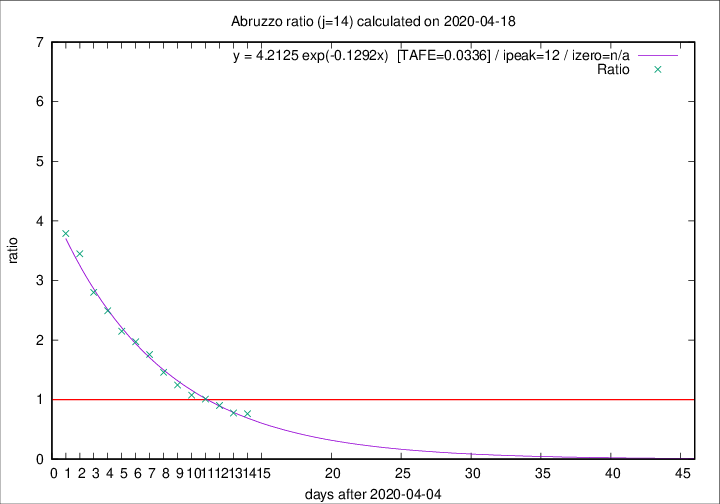
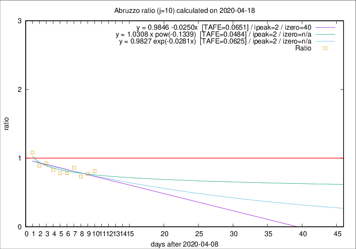

# Abruzzo

Data source: https://raw.githubusercontent.com/pcm-dpc/COVID-19/master/dati-json/dpc-covid19-ita-regioni.json

Estimates in this page were made on 19/4/2020 with data available until 18/04/2020.

## Summary 

### Peak estimate 
|j|linear [TAFE]|exponential [TAFE]|power law [TAFE]|details|
|---|----|-----------|---------|-------|
|7|14/4/2020 [TAFE=0.1052]|14/4/2020 [TAFE=0.1017]|14/4/2020 [TAFE=0.0968]|[analysis](COVID-19_abruzzo_j7_2020-04-18.md)|
|8|13/4/2020 [TAFE=0.0918]|13/4/2020 [TAFE=0.0906]|13/4/2020 [TAFE=0.0867]|[analysis](COVID-19_abruzzo_j8_2020-04-18.md)|
|9|12/4/2020 [TAFE=0.0617]|12/4/2020 [TAFE=0.0619]|12/4/2020 [TAFE=0.0587]|[analysis](COVID-19_abruzzo_j9_2020-04-18.md)|
|10|11/4/2020 [TAFE=0.0651]|11/4/2020 [TAFE=0.0625]|11/4/2020 [TAFE=0.0484]|[analysis](COVID-19_abruzzo_j10_2020-04-18.md)|
|11|14/4/2020 [TAFE=0.0956]|13/4/2020 [TAFE=0.0758]|12/4/2020 [TAFE=0.0399]|[analysis](COVID-19_abruzzo_j11_2020-04-18.md)|
|12|15/4/2020 [TAFE=0.1108]|15/4/2020 [TAFE=0.0711]|14/4/2020 [TAFE=0.0637]|[analysis](COVID-19_abruzzo_j12_2020-04-18.md)|
|13|16/4/2020 [TAFE=0.1314]|16/4/2020 [TAFE=0.0709]|15/4/2020 [TAFE=0.0882]|[analysis](COVID-19_abruzzo_j13_2020-04-18.md)|
|14|17/4/2020 [TAFE=0.1515]|17/4/2020 [TAFE=0.0336]|18/4/2020 [TAFE=0.1415]|[analysis](COVID-19_abruzzo_j14_2020-04-18.md)|

Best estimator is exp with j=14 (TAFE=0.0336)
Corresponding peak date estimate is 17/4/2020 (ipeak 12)

Peak date range estimate: 7/4/2020 - 18/4/2020

### End estimate 
|j|linear [TAFE/TFE]|exponential [TAFE/TFE]|power law [TAFE/TFE]|details|
|---|----|-----------|---------|-------|
|7|-|-|-|[analysis](COVID-19_abruzzo_j7_2020-04-18.md)|
|8|-|-|-|[analysis](COVID-19_abruzzo_j8_2020-04-18.md)|
|9|-|-|-|[analysis](COVID-19_abruzzo_j9_2020-04-18.md)|
|10|19/5/2020 [TAFE=0.0651]|-|-|[analysis](COVID-19_abruzzo_j10_2020-04-18.md)|
|11|-|-|-|[analysis](COVID-19_abruzzo_j11_2020-04-18.md)|
|12|-|-|-|[analysis](COVID-19_abruzzo_j12_2020-04-18.md)|
|13|-|-|-|[analysis](COVID-19_abruzzo_j13_2020-04-18.md)|
|14|-|-|-|[analysis](COVID-19_abruzzo_j14_2020-04-18.md)|

Best estimator is linear with j=10 (TAFE=0.0651)
Corresponding end date estimate is 19/5/2020 (izero 40)

End date range estimate: 9/4/2020 - 19/5/2020

Generated April 19th, 2020 at 18:42:39 UTC+0200 with https://github.com/robianc/COVID-19
