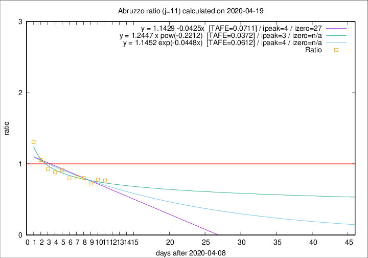

# Abruzzo

Data source: https://raw.githubusercontent.com/pcm-dpc/COVID-19/master/dati-json/dpc-covid19-ita-regioni.json

Delta days analysis (j): 11

Analyses for other values of j for 2020-04-19 are avalable [here](../2020-04-19/README.md)

Analyses for Abruzzo for previous dates are avalable [here](../README.md)

## Fitting 
|fit type|best fit equation|tafe|tfe|ipeak|izero|
|-------|-----|--------|------|---|---|
|linear|y = 1.1429 -0.0425x  [TAFE=0.0711]|0.0711|0.0063|4|27|
|exp|y = 1.1452 exp(-0.0448x)  [TAFE=0.0612]|0.0612|0.0028|4|n/a|
|pow|y = 1.2447 x pow(-0.2212)  [TAFE=0.0372]|0.0372|0.0007|3|n/a|

## Data
|Date|Daily deaths|Cumulated deaths|Deaths in the last 11 days|Deaths in the 11 days before|ratio|
|----|----------|-----------|-------|--------------------|-----|
|2020-04-19|5|258|79|103|0.7670|
|2020-04-18|7|253|81|104|0.7788|
|2020-04-17|3|246|77|106|0.7264|
|2020-04-16|3|243|85|106|0.8019|
|2020-04-15|8|240|87|107|0.8131|
|2020-04-14|8|232|86|108|0.7963|
|2020-04-13|12|224|91|100|0.9100|
|2020-04-12|6|212|89|101|0.8812|
|2020-04-11|8|206|91|98|0.9286|
|2020-04-10|4|198|96|91|1.0549|
|2020-04-09|15|194|106|81|1.3086|

[Download data as CSV](COVID-19_abruzzo_j11_2020-04-19.csv)

Generated April 19th, 2020 at 18:42:39 UTC+0200 with https://github.com/robianc/COVID-19
